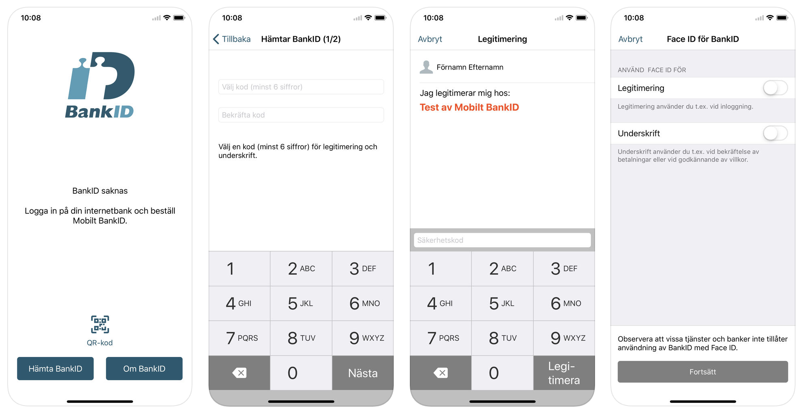
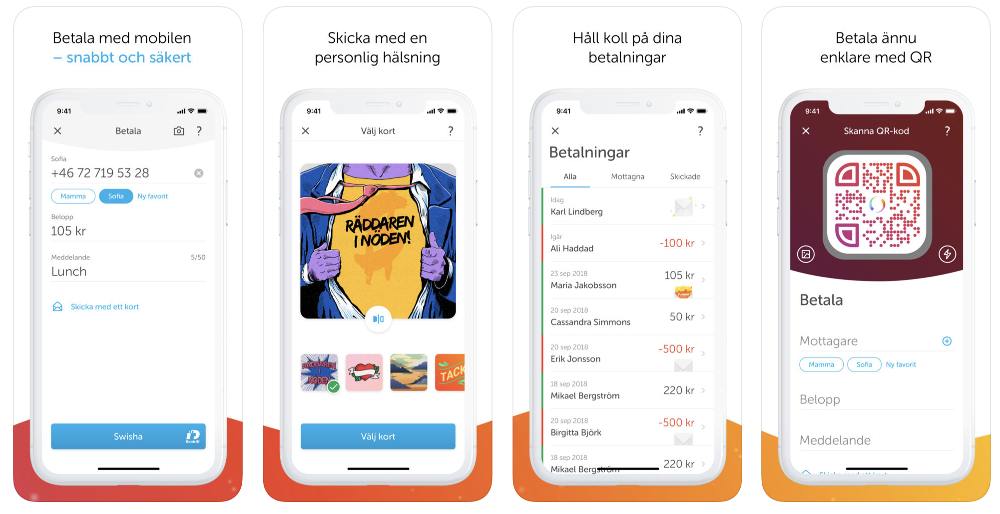

BankID y Swish son las aplicaciones mas utilizadas en Suecia para poder identificarse y poder mover dinero, rentas, compras, compras en línea, registro en sistemas como vivienda, acceso a bancos en línea y demás.

## BankID

Empecemos con BankID. BankID es una solución de identificación de ciudadanos que permite a las empresas, bancos y agencias gubernamentales autenticar y celebrar acuerdos con personas a través de Internet. BankID tiene 8 millones de usuarios activos. Se proporcionan muchos servicios donde los ciudadanos pueden usar su BankID para la identificación digital, así como para firmar transacciones y documentos. Los servicios varían desde banca en línea y móvil, comercio electrónico hasta declaración de impuestos y son proporcionados por el gobierno, el municipio, los bancos y las empresas. BankID se utiliza tanto para la identificación como para la firma. Según la ley sueca, y dentro de la Unión Europea, BankID es una firma avanzada y una firma hecha con un BankID es legalmente vinculante.

Para obtener un BankID según mi experiencia, primero debes tener un Numero Personal (es como numero de identidad o numero de seguro social). Una vez tienes eso, puedes abrir una cuenta de banco en cualquiera de los [bancos que usan BankID](https://www.bankid.com/en/om-bankid/detta-ar-bankid). Una vez tienes cuenta de banco puedes crear tu BankID con ellos, además debes [descargar la App de BankID](https://itunes.apple.com/se/app/bankid-s%C3%A4kerhetsapp/id433151512?mt=8) de la web.

El proceso requiere que tengas un numero de celular con acceso a internet y recibes un código para registrar la App con tu celular, luego requiere que elijas un código de 6 dígitos que será tu contraseña para poder firmar o identificarte en algún sitio en línea que lo requiera. Muchos sitios en línea que requieren autenticación poseen la opción de identificarte usando BankID, entras al sitio web, elijes BankID para identificarte y en ese momento debes tener tu celular a mano para abrir la aplicación y confirmar tu acceso a dicho sitio en línea ingresando tu PIN Code de 6 dígitos. En el caso de iPhone puedes usar el FaceId en lugar del PIN Code.

## Swish

Mil millones de pagos. Suecia es a menudo reconocido como un modelo a seguir cuando se trata de pagos sin efectivo, y el pueblo sueco ha demostrado que lo merecemos. A partir de hoy, los usuarios de Swish han completado hoy 1,000,000,000 de pagos, ¡una cantidad increíble considerando nuestra pequeña población! Mil millones Desde el inicio en 2012. Qué viaje hemos estado juntos.

El texto anterior es lo que se lee en el sitio de [Swish](https://www.getswish.se/frontpage/). Swish se puede usar para individuos y también para empresas. Los pagos/transferencias vía Swish se hacen en tiempo real.

### Swish - una colaboración entre los bancos más grandes de Suecia

El trabajo para desarrollar Swish comenzó como una colaboración entre seis de los bancos más grandes de Suecia. Juntos, Danske Bank, Handelsbanken, Länsförsäkringar, Nordea, SEB y Swedbank y Sparbankerna poseen el Getswish AB. Hoy, varios bancos se han unido a Swish. Cada banco es responsable de diseñar ofertas, términos y tarifas por el servicio a sus clientes. Puede encontrar más información sobre los términos y condiciones que se aplican a su banco en su sitio web.

**Swish a tus amigos.**
Swish hace que los pagos diarios sean más fáciles. Por ejemplo, puede usar Swish si usted y sus amigos deben compartir la nota después de una visita al restaurante o unirse para un regalo conjunto.

**Swish cuando compras.**
En muchas empresas de comercio electrónico, tiendas, pequeñas empresas y asociaciones, encontrará Swish como método de pago. Con Swish en tu teléfono inteligente puedes pagar en cualquier momento y en cualquier lugar.

**Número de móvil en lugar de número de cuenta.**
Con Swish nunca tienes que dar tu número de cuenta. Lo único que se necesita es un número de móvil para personas privadas o un número de Swish para empresas, asociaciones u organizaciones.

### Funcionalidades de Swish

- **Pagos:** Todas las transacciones se guardan para que pueda realizar un seguimiento de los pagos recibidos y enviados.
- **Favoritos:** Guarde a las personas con las que hace swish a menudo como favoritas para que no tenga que ingresar su número de móvil cuando las usa.
- **Enviar con una tarjeta:** Cuando swish, puede enviar una tarjeta en su pago. Puede elegir entre varias ilustraciones diferentes, y cuando el destinatario recibe el pago, se muestra como un paquete en la aplicación.
- **Códigos QR:** Con la ayuda de los códigos QR, sus pagos serán aún más rápidos. La información de pago se completará automáticamente cuando escanee un código QR y solo necesita aprobar el pago.

## Conclusión

¡Wow!, debo confesar que este asunto de BankID y de Swish me tiene fascinado. Esta semana pude obtener mi BankID y por ende usar la App de Swish y he estado encantado de todo el potencial que tiene, un amigo me había prestado 485 SEK para poder pagar mi cita en la oficina de migración y obtener mi tarjeta de identidad, y los 85 SEK fue de un almuerzo que me pago el otro día, ya con Swish pude cancelarle el favor.

Esta semana pague la renta de mi apartamento, adivinen como; Swish. Y lo que mas me fascina es que es inmediato, puedes pagar en negocios, puedes pagarles a los amigos, después de una cena en un restaurante se dividen la cuenta y pagan. ¿Se imaginan las ventajas para el comercio electrónico?, creo que por eso estoy bastante emocionado por dicha herramienta.

Termino con un pensamiento:

> La diferencia entre Suecia y el resto de los países desarrollados es; la Sociedad. La tecnología es la misma que en nuestros países en Latinoamérica.

 Los lenguajes de programación son los mismos, no usan un lenguaje de programación diferente al que se usa y se enseña en el resto de los países. La diferencia es que la Sociedad, los bancos, están usando la tecnología para tareas cotidianas y hacerle la vida mas fácil a todos, y no, no hay egoísmo, hay colaboración.
