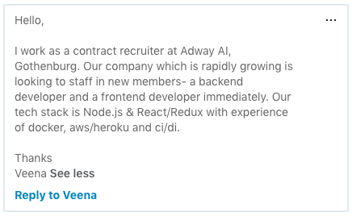

En los últimos días he estado meditando mucho acerca de que debemos estudiar en esta era digital, en la que la era industrial ya esta siendo reemplazada por la era de la información y las comunicaciones. Muchas empresas tradicionales están cerrando y no vale la pena pensar en especializarse en ciertos campos. En este articulo quiero ampliar algunas de las opciones que recomiendo para abrirte paso en esta era digital y poder obtener un trabajo que sea desafiante, excitante y de continuo crecimiento, aparte que además te permita abrirte hacia nuevos horizontes.

## ¿Que estudiar?

No me canso de repetir una y otra y otra y otra vez que lo que debes estudiar es algún tema/habilidad/disciplina relacionada con la tecnología.

Pero, ¡no me gusta programar, como a ti te gusta! Esa podría ser una respuesta o un pensamiento que alguien me podría dar, a lo que respondería: ¿Y?, ¿Que con eso?, ¿Acaso la tecnología es solamente programar?

¡Pues No!

El haberme interesado en las computadoras y los lenguajes de programación, y el poder crear aplicaciones móviles y sitios web, ha sido sin duda la mejor decisión que he hecho en mi vida, apoyado por mi madre que me oriento a estudiar una carrera técnica en el colegio, a diferencia de mi hermano que en aquellos años estudio solamente bachiller en ciencias y letras y pues no hay muchas opciones para trabajar siendo solamente un bachiller.

Entonces, suponiendo que la programación no es lo tuyo, la cual puede ser la situación de muchas personas, déjame decirte que también puedes trabajar en tecnología en diferentes cargos o posiciones y al mismo tiempo estar cerca de los mas recientes avances tecnológicos y tener un perfil interesante para los reclutadores de empresas no solamente nacionales, sino que también internacionales.

### No, ya en serio. ¿Que podría estudiar?

En este mundo de la era digital en la que nos encontramos inmersos puedes estudiar y trabajar en las siguientes áreas:

#### Quality Analyst, Tester

En la mayoría de las empresas de tecnología llámese empresas de IT, desarrollo web, desarrollo móvil y demás, se ocupan especialistas en probar las aplicaciones y funcionalidades usando herramientas sencillas como simplemente un Smartphone, una computadora, una Tablet, ha usar herramientas mas especializadas como aplicaciones para poder crear Test Cases y ayudar a los desarrolladores a encontrar fallas en el diseño, estructura o funcionalidad de una aplicación ya sea hardware o software.

_Requisitos: Saber usar una computadora, estar familiarizado con Smartphone y ser curioso._

#### Diseñador Grafico

Puede que sea una de las carreras un poco mas especializadas que la anterior, algo estresante, similar al de desarrollador web o móvil. Acá si debes tener pasión por el diseño, ser creativo y lo mas probable recibir varios cursos o certificados en el uso de aplicaciones para poder diseñar como Adobe, Sketch y demás.

_Requisitos: Pasión por el diseño, creatividad y manejo de Suites como Adobe, Sketch._

#### Marketing Digital

Mercadologo digital, Community Manager podría ser también, claro algo de conocimientos en fotografía y diseño seria un plus. Hoy en día las empresas ocupan personas que sepan capturar y atraer clientes a través de la web, mediante redes sociales, sitio web, campañas publicitarias, canales de video como Youtube y demás plataformas.

_Requisitos: Pasión por el mercado/ventas, excelentes actitudes de servicio al cliente y recomendaria un par de cursos respecto al tema en cualquier plataforma de enseñanza en línea como Udemy.com_

#### Sales Representatives

Mi esposa trabajo en este rubro un par de años. La empresa para la que trabajaba esta ubicada en los Estados Unidos y ella se dedicaba a atender llamadas de clientes y pedidos de clientes mediante el sitio web de la empresa. Ella recibía los pedidos y los diseñaba en un programa online para luego enviarle la cotización al cliente y este decidía hacer o no la compra. Una vez mas Internet, manejo de la computadora y en este caso el Ingles, piezas claves.

_Requisitos: Excelentes habilidades computacionales en general; navegar por internet, uso de Smartphone, envío de correos electrónicos, uso de herramientas para comunicación en línea como Skype, manejo casi al 100% del ingles y excelente conexión a internet._

#### Científico de Datos (Data Scientist/BI)

No conozco mucho este campo ya que es un campo nuevo, pero de gran crecimiento, en el cual manejas datos y extraes información valiosa de dichos datos, que ayuda a la toma de decisiones de las empresas. Con el crecimiento del Big Data, esta ha sido una carrera de bastante auge y ciertamente muy bien pagada. Les dejo el blog de mi buen amigo [Jaime Escoto](http://blog.jescoto.com/), quien ha estado trabajando mucho en el área del BI (Business Intelligence).

_Requisitos: Excelentes habilidades de comunicación, uso de herramientas para visualización de datos, minería de datos y sobre todo un excelente manejo del ingles, este ultimo requisito es primordial, ya que como es un campo nuevo la mayoría de las empresas que ofrecen esta tipo de puestos son del exterior._

#### DevOps

Sin duda otro campo que requiere bastante especialización y sobre todo tener experiencia como programador. Tu trabajo seria integrar el código de los programadores con las diferentes herramientas de IT que sean necesarias para echar a andar los negocios en línea. Otra área de bastante crecimiento en la actualidad. Les recomiendo el blog de mi buen amigo Camilo Rivera [A DevOps From Honduras](https://camilo.riverapineda.com/), quien ahora trabaja y vive en Singapur junto a su hermosa familia.

_Requisitos: Experiencia como programador, conocimientos de las diferentes soluciones en la nube que ofrecen empresas como Google, Amazon y Microsoft. No es necesario todas, pero al menos una de las tres._

#### Product Manager

Básicamente tu trabajo seria poder trasladar las metas del proyecto/organización en acción, trabajar en base a objetivos y métricas establecidas, comprender las necesidades de los usuarios y clientes del proyecto para así poder entregar la mejor experiencia de usuario posible.

_Requisitos: Manejo de productos, lanzamiento de productos, excelentes habilidades computacionales, manejo de reuniones en línea, manejo de herramientas de administración de proyectos, envío de correos, experiencia en Startups._

#### Bussines Relationships

Tu trabajo seria manejar las relaciones con el cliente, entenderle y ayudar al equipo a poder satisfacer las necesidades de sus clientes.

_Requisitos: Excelente comunicación, entusiasmo, pasión por las necesidades de los clientes y excelente manejo de sistemas computacionales como aplicaciones para reuniones en línea, envíos de correo uso de aplicaciones móviles._

#### Programador de Aplicaciones

Por último, pero sin duda no deja de ser importante, y es acá donde yo me ubico. El poder crear soluciones que no existían y el poder tomar una idea y hacerle realidad, el poder crear un negocio de la nada usando el internet, la web y las aplicaciones de software, es el porque estoy en esta carrera. Carrera que me ha permitido llegar a lugares inimaginables años atrás, me ha permitido salir de mi país y ampliar mis fronteras y hacer de este mundo un lugar mas pequeño y menos desafiante ante mis ojos después de todo.

_Requisitos: Paciencia, perseverancia, enfocado en encontrar soluciones, tener una mente que lo cuestione todo y sobre todo el deseo de construir algo._

## Internacionalización

Quiero dedicar un par de líneas a este tema. En nuestros países de Latinoamérica, el acceso a estos puestos de trabajo no es algo de bastante demanda, ha habido un crecimiento interesante en los últimos años lo cual me hace pensar que vamos por el camino correcto. En mi caso uno de los deseos que siempre hemos tenido con mi esposa es el poder salir de nuestro hermoso y pesimamente administrado país; Honduras. He visto como cada cierto tiempo empresas fundadas en el exterior como es el caso de Estados Unidos han ido contratando mas y mas profesionales e incluso practicantes en los puestos descritos en este articulo.

¡Y eso es algo sencillamente genial! Podría mencionar algunas como AcklenAvenue.com, HeroUnit.io, Iconic. Debemos estar bastante agradecidos con estas empresas por confiar y contratar mano de obra local. Ya que estas empresas abren las posibilidades para formas profesionales/expertos que luego puedan aplicar a empresas aun mas internacionales.

En mi caso, desde que tuve la oportunidad de viajar a San Diego, California (la que es mi ciudad favorita de los Estados Unidos), pude ver y experimentar la riqueza tecnológica y de emprendimiento que dichas ciudades ofrecen, así como las comodidades y el hecho de trabajar/vivir en un ambiente tecnológico tan desafiante. Desde ese día (y que conste que solamente estuve 1 semana) algo cambio en mi interior, algo hizo clic, y desde ese día soñé en algún día poder salir de mi país y poder experimentar ese ambiente de crecimiento tecnológico.

Salir de mi país no fue fácil, y no lo sigue siendo aun hoy en día. Pero me ha permitido poder seguir creciendo en un mundo lleno de tecnología, donde la tecnología no es una amenaza, sino que es un recurso para mejorar la calidad de vida de la población en general. Salir de mi país fue el primer paso (y el mas difícil), ¡aparte del idioma claro!, pero gracias a eso recibo semanalmente ofertas de trabajo relacionadas a mi área de conocimiento, ¡la demanda es altísima!

Adjunto algunas de ellas:

  

## Conclusión

Podríamos resumir 3 habilidades:

1. Excelente manejo de Ingles
2. Excelente manejo de la computadora/Smartphone/Tablet
3. Excelente comunicación

Si encuentras alguna otra carrera/puesto que piensas debe ir en esta lista, favor escríbelo en la sección de comentarios, o si tienes algún comentario en general de mi descripción, será bienvenido.

¡Hasta la Próxima!
