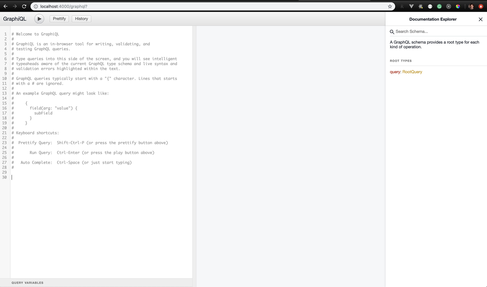
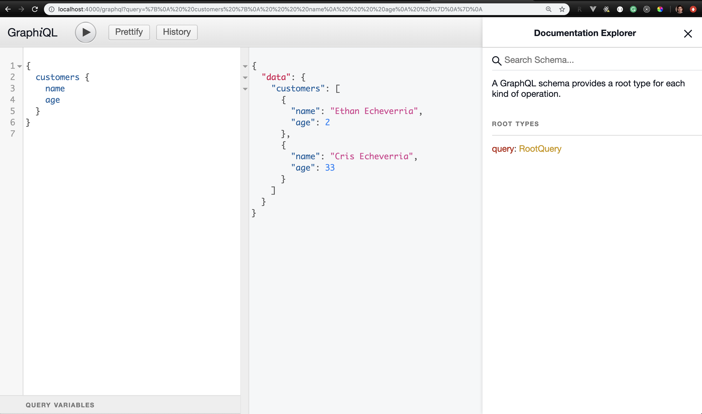

En las ultimas semanas he estado aprendiendo y experimentando un poco con GraphQL, una tecnología que tal parece vino a quedarse y que como sorprendentemete me he dado cuenta no necesariamente viene a reemplazar REST API del todo, pero que a su vez, puedo finalmente comprender el porqué de su popularidad y la necesidad de crearlo por parte de los ingenieros en Facebook.

## ¿Cuál es el motivo por el cual Yo usaria GraphQL?

El motivo principal es poder hacer consultas/queries a un end-point especificando unicamente los datos que ocupo me devuelva dicho end-point.

En un REST API cuando ocupamos saber el listado de los autores de un sistema de publicación, haríamos algo como lo siguiente:

`GET /authors`

Esto nos daria como resultado probablemente un arreglo de datos con todos los autores y TODOS sus campos o keys.

Con GraphQL, podemos especificar que campos/keys queremos nos retorne el llamado al end-point, en ese caso hariamos un `query` algo parecido al siguiente:

```javascript
{
  authors {
    name
    email
  }
}
```

En este caso el resultado probable seria un arreglo con todos los autores, pero en este caso SOLAMENTE los campos/keys que acabo de especificar como ser `name, email`, eso, me parece algo sensacional, sobre todo si tienes un nodo con decenas de campos/keys dentro de tu esquema.

Ahora bien, en caso de hacer un llamado a los datos de un autor en específico incluyendo los libros publicados por dicho autor, lo mas probable necesites pasar un parametro/llave para identificar el autor que deseas de la lista de autores existentes. En ese caso, el llamado al end-point seria algo similar a esto:

`GET /author/:id/books`

En GraphQL, seria un query similar al siguiente:

```javascript
{
  author (id: "1") {
    name
    books {
      title
    }
  }
}

// Autor, Libro en especifico:
{
  author (id: "1") {
    name
    book (id: "5") {
      title
    }
  }
}
```

Algunos argumentan que al hacer estos querys con GraphQL reduce la cantidad de llamadas que se hacen al servidor, por lo tanto, es mas rapido que usar REST API. Desconozco a mayor profundidad si esto es asi o no, pero lo que si se, es que GraphQL no vino a eliminar REST API, es mas, dirian que GraphQL muchas veces necesita de REST API, pero eso lo dejo a vuestro criterio profesional.

## Creación de nuestro servidor de GraphQL con ExpressJS

Bien, luego de una breve introduccion respecto a los conceptos entre ambas tecnologías, procedamos a crear nuestro servidor, para ello lo primero seria crear nuestro proyecto dentro de NodeJs de una carpeta X, luego usaremos las siguientes librerias:

`npm install --save express graphql express-graphql`

Crear un archivo `server.js` y agrega el siguiente codigo:

```javascript
const express = require("express");
const expressGraphQL = require("express-graphql");
const schema = require("./schema.js");
const app = express();

app.use(
  "/graphql",
  expressGraphQL({
    schema: schema,
    graphiql: true
  })
);

app.listen(4000, () => {
  console.log("Server is running on port 4000...");
});
```

El archivo anterior nos permite tener la estructura básica de un servidor con ExpressJS y al mismo tiempo creamos un schema para conectar ExpressJS con GraphQL mediante la libreria `express-graphql`. Es por eso que usamos dentro de nuestra app de ExpressJS la funcion llamada como expressGraphQL la cual recibe un objeto con dos propiedades, `schema` y `graphiql`:

```javascript
app.use(
  "/graphql",
  expressGraphQL({
    schema: schema,
    graphiql: true
  })
);
```

Aun no hemos definido nuestro archivo `schema.js`, pero lo haremos en un momento, lo otro que hay que destacar es que usamos un end-point para nuestro servidor de GraphQL en este caso le llamamos como `/graphql`, el nombre es lo de menos, puede ser cualquiera, esto esta conectado con la segunda propiedad de la libreria express-graphql la cual es `graphiql: true`, esto es para poder usar la función gráfica de GraphQL que nos permite probar los queries que deseamos usar para nuestro proyecto.

Ahora vamos a crear el schema que nos hace falta para poder ejeecutar nuestro servidor de GraphQL de manera correcta, si lo hacemos en este momento, veremos un error en la ruta de nuestro servidor `localhost:4000/graphql`.

Dentro de `schema.js` crea lo siguiente:

```javascript
const {
  GraphQLObjectType,
  GraphQLString,
  GraphQLInt,
  GraphQLSchema,
  GraphQLList,
  GraphQLNonNull
} = require("graphql");

const customers = [
  { id: "1", name: "Ethan Echeverria", email: "ethan@gmail.com", age: 2 },
  { id: "2", name: "Cris Echeverria", email: "cris@gmail.com", age: 33 },
  { id: "3", name: "Mariela Carcamo", email: "mary@gmail.com", age: 28 }
];

// Customer Type
const CustomerType = new GraphQLObjectType({
  name: "Customer",
  fields: {
    id: {
      type: GraphQLString
    },
    name: {
      type: GraphQLString
    },
    email: {
      type: GraphQLString
    },
    age: {
      type: GraphQLInt
    }
  }
});

const RootQuery = new GraphQLObjectType({
  name: "RootQuery",
  fields: {
    customers: {
      type: new GraphQLList(CustomerType),
      resolve(root) {
        return customers;
      }
    }
  }
});

module.exports = new GraphQLSchema({
  query: RootQuery
});
```

Ahora sí, ejecuta el servidor mediante el comando `node server.js` desde tu terminal y luego en tu navegador ingresa a la dirección `http://localhost:4000/graphql`, si todo marcha bien, deberias poder ver lo siguiente:



Esta herramineta gráfica es bastante útil para poder probar los diferentes queries que deseamos usar en el Front End de nuestra aplicacion web, por ejemplo, escribe el siguiente query:

```
{
  customers {
    name
    age
  }
}
```



## Paso a paso
Bien, voy a describir paso a paso los bloques de código, primero tenemos los tipos de elementos que podemos crear con GraphQL. Creo que sus nombres en si son bastante explicativos

```javascript
const {
  GraphQLObjectType,
  GraphQLString,
  GraphQLInt,
  GraphQLSchema,
  GraphQLList,
  GraphQLNonNull
} = require("graphql");
```
Luego tenemos nuestra lista de clientes, en este caso es solamente un arreglo de clientes estatico pero puedes reemplazarlo con un llamado a una base de datos cualquiera

```javascript
const customers = [
  { id: "1", name: "Ethan Echeverria", email: "ethan@gmail.com", age: 2 },
  { id: "2", name: "Cris Echeverria", email: "cris@gmail.com", age: 33 },
  { id: "3", name: "Mariela Carcamo", email: "mary@gmail.com", age: 28 }
];
```
Ahora definimos el primer Objeto de GraphQL basado en la informacion que tenemos de nuestro arreglo de Customers anterior:

```javascript
// Customer Type
const CustomerType = new GraphQLObjectType({
  name: "Customer",
  fields: {
    id: {
      type: GraphQLString
    },
    name: {
      type: GraphQLString
    },
    email: {
      type: GraphQLString
    },
    age: {
      type: GraphQLInt
    }
  }
});
```
Finalmente, creamos un query principal en el cual especificamos los queries que tendra nuestro servidor, por ahora hemos creado un query llamado `customers` que acepta una key `type` y una funcion `resolve` que se encarga de retornarnos el listado de customers que definimos como base de datos.

```javascript
const RootQuery = new GraphQLObjectType({
  name: "RootQuery",
  fields: {
    customers: {
      type: new GraphQLList(CustomerType),
      resolve(root) {
        return customers;
      }
    }
  }
});

module.exports = new GraphQLSchema({
  query: RootQuery
});
```

Al final creamos el `GraphQLSchema` y lo exportamos, es dicho Schema el que usamos en nuestro servidor

```javascript
app.use(
  "/graphql",
  expressGraphQL({
    schema: schema,
    graphiql: true
  })
);
```

## Consulta con parametro

Ahora agregaremos una consulta a un Customer, pasando como parametro su Id, modificaremos nuestro `RootQuery`

```javascript
const RootQuery = new GraphQLObjectType({
  name: "RootQuery",
  fields: {
    customer: {
      type: CustomerType,
      args: {
        id: { type: GraphQLString }
      },
      resolve(root, args) {
        for (let i = 0; i < customers.length; i++) {
          if (customers[i].id == args.id) {
            return customers[i];
          }
        }
      }
    },
    ...
  }
});
```

Como pueden observar hemos agregado uun Nodo mas a nuestra propiedad `fields` y hemos definido el `type` el argumento en este caso usando `args` y finalmente la funcion `resolve` que basicamente recorremos el arreglo de customers buscando de acuerdo al `id`

Y con eso tenemos nuestro servidor de GraphQL el cual nos permite hacer Querys hacia los datos que deseamos obtener del Backend. Hace falta ver el tema de las mutaciones, pero ese tema lo veremos otro dia.

¡Hasta la próxima!

## [Ver Código fuente](https://github.com/crisecheverria/tutorial-servidor-graphql-express)
