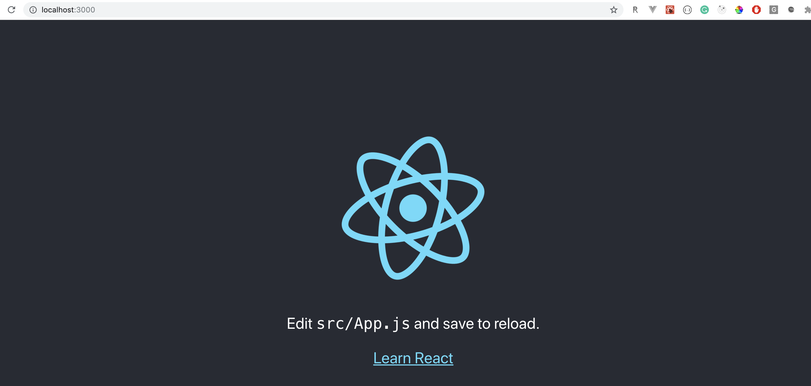

Este es mi primer artículo respecto a ReactJs en lo que llevo de existencia. Últimamente he estado trabajando un poco con Hooks, específicamente transformando Class Components existentes a Function Component usando Hooks. Y he decidido compartir un poco lo que he ido aprendiendo en el camino con un proyecto que les puede ser útil como lo ha sido para mí.

### Qué vamos a construir?

Un compañero de trabajo tiene sitio donde guarda los Links que desea leer y así tener acceso a ellos en cualquier momento. Así que basado en eso y en un [artículo que leí](https://levelup.gitconnected.com/how-to-use-react-js-to-create-chrome-extension-in-5-minutes-2ddb11899815) respecto a cómo crear una extensión de Google Chrome con ReactJs, vamos a hacer éso mismo.

Pasa que cada vez que encuentro un artículo interesante y bastante útil me lo reenvío a mi correo y pues no es lo más práctico de hacer ya que mi bandeja se llena de correos y yo soy de las personas que me gusta mantener mi bandeja de correos sin leer en 0


### Tecnologías

Como mencionaba vamos a usar:

- create-react-app
- BulmaCSS
- Google Chrome (también se puede configurar para FireFox)

Así que manos a la obra!

### 1. Crear la aplicación con React

En este caso usare React, pero se puede llevar a cabo con VueJs, Angular e incluso Vanilla Javascript, pero por simplicidad y por motivos de mi experiencia y apego con React decidí hacerlo usando `create-react-app`. Desde tu terminal escribe los siguientes comandos:

```
npx create-react-app chrome-extension
cd chrome-extension
npm start
```

Al usar `npx create-react-app` no necesitamos tener instalado **create-react-app** localmente, el proyecto se construye desde la web. Si navegamos a la url **http://localhost:3000/** veremos la siguiente imagen



Proceguimos a modificar la estructura de archivos del proyecto que recién creamos, eliminamos un par de hojas de estilos (index.css, app.css) que no ocupamos así como el logo de react (logo.svg)


Aparte modificamos el archivo **App.js** eliminando referencias a la hoja de estilo eliminada así como al logo de react y simplificamos el contenido del componente. Desde ya podemos observar el uso de Function Component por parte del equipo de **create-react-app**


**Nota:**
No olvides abrir el archivo **index.js** y eliminar la referencia a la hoja de estilo **index.css**

### 2. React Hooks

Hooks es una nueva adición en React 16.8.

> Te permite usar state y otras funcionalidades de React sin necesidad de escribir una clase.

El equipo de React aclara en su [sitio web](https://reactjs.org/docs/hooks-intro.html) que Hooks no rompe ningún código que de React que tu ya tengas en tus proyectos (es más, puedes combinar Class Component con Function Components vía Hooks).

Hooks es:

- Completamente Opcional
- 100% compatible con tu código existente
- React No tiene planes de eliminar Class Component de su core.
- Hooks no reemplaza tu conocimiento previo sobre el funcionamiento de React

Te invito a que leas un poco más acerca de lo que acabo de mencionar, así como la motivación para la implementación de Hooks en React en su sitio web.

### useState

**useState** es el primer Hook que usaremos dentro de nuestro componente **.src/App.js**

```js
import React, { useState } from 'react'
```

Importamos dicho Hook para poder agregar **state** a un Functional Component (cosa que antes era solamente posible de hacer con los Class Components). React preservará el state entre cada re-render.

Seguimos modificando el componente...

```js
import React, { useState } from 'react'

function App() {
  const [articles, setArticles] = useState([])
  return (
    <div>
      <h2>Hello world!</h2>
    </div>
  )
}

export default App
```

**useState** retorna un par: el valor del state actual, en este caso 'articles', y una función que nos permite actualizar dicho state, en este caso 'setArticles'.

Tú puedes llamar a la función creada `setArticles` para modificar el valor de `articles` desde algún event handler o desde cualquier otro lugar de tu Functional Component. Es similar a usar `this.setState` en un Class Component.

Además inicializamos el valor del state `article` usando `useState([])`, lo cual es un arreglo vacío.

Podemos inicializar los states con los valores que deseamos, ya sea Strings, Objetos, Arreglos, Números, Booleanos, etc., en nuestro caso un arreglo vacío. Esto permite recordar o notificar al resto de developers que almacenaremos un arreglo en dicho state.

Puedes llamar/usar el Hook useState() cuantas veces creas necesario y debido a que usamos [array destructuring](https://developer.mozilla.org/es/docs/Web/JavaScript/Referencia/Operadores/Destructuring_assignment#Array_destructuring) nos permite asignarle cualquier diferente nombre a las variables que declaremos como state.

### useEffect

Seguiremos con el segundo Hook, useEffect. Cada vez que hacemos fetch de alguna data desde una API en nuestros componentes, estamos haciendo lo que se le conoce como un 'side effect' y generalmente lo hacemos dentro del Lifecicle method de React conocido como `componentDidMount()`.

**useEffect**, agrega la habilidad de realizar 'side effects' desde un Functional Component. Lleva a cabo la misma funcionalidad de los siguientes métodos de los Class Component:

- componentDidMount()
- componetDidUpdate()
- componentWillUnmount()

Nuestro código sería así:

```js
// Importamos el Hook useEffect de React
import React, { useState, useEffect } from 'react'

function App() {
  const [articles, setArticles] = useState([])

  // Acá implementamos useEffect()
  // Es similar a componentDidMount
  useEffect(() => {
    const localStorageArticles = getObject('articles')
    if (localStorageArticles !== undefined) setArticles(localStorageArticles)
  }, [])

  return (
    <div>
      <h2>Hello world!</h2>
    </div>
  )
}

// antes de default va export => export default App
export default App
```

Hemos importado useEffect de React y además lo estamos usando para llamar a la función `getObject` pasánsole un String, luego declararemos dicha función. Por ahora, lo más importante que debes saber es que cuando usamos useEffect de la siguiente forma

```js
useEffect(() => {}, [])
```

Puedes ver que declaramos un arreglo vacío al final, ésto es similar a hacer un componentDidMount().

Aparte usamos un condicional para verificar que la función getObject() no nos retorne un valor vacío, de lo contrario, actualizamos nuestro state usando la función `setArticle(localStorageArticles)`

### 3. LocalStorage

> Vamos a guardar todos los Links que deseamos leer luego, en nuestro navegador.

Para eso ocupamos tener acceso al LocalStorage dentro de nuestra Extensión de Chrome/FireFox, más adelante veremos cómo activar localStorage en nuestra extensión. Por ahora, definamos la función `getObject(string)` y demás funciones.

Creamos una nueva carpeta llamada **Helpers** dentro de la carpeta **src** quedando la ruta así `./src/helpers/index.js`

```js
// ./src/helpers/index.js
export const getItem = key => window.localStorage.getItem(key)

export const getObject = key => {
  const result = getItem(key)
  try {
    return JSON.parse(result)
  } catch (e) {
    return result
  }
}
```

El código es más que claro, es Vanilla Javascript, son dos funciones `getItem` y `getObject`, la primera nos dá acceso al localStorage vía `window.localStorage.getItem`.

Ahora, importamos la función getObject() en nuestro componente anterior

```js
// ./src/App.js
import React, { useState, useEffect } from 'react';
import { getObject } from './helpers';

function App() {
  ...
```

Vamos a cambiar nuestro `<h2>Hello World!</h2>` por el siguiente código:

```js
<h2>
  Artículos: {articles && articles.length}
  {!articles && 0}
</h2>
```

Estamos mostrando finalmente el state que hemos creado con useState(), en este caso es `article`, pero actualmente está vacío [ ], por eso hacemos un condicional: si `articles` tiene un valor, entonces imprimimos la cantidad de artículos, en caso contrario mostramos el número 0.

### 4. Agregar Links

Finalmente haremos un componente para poder agregar Links en el localStorage del navegador. Para ello vamos a crear una nueva carpeta en el `./src` y la llamaremos **components**. Dentro creamos AddLink.js

```jsx
/*  ./src/components/AddLink.js */
import React from 'react'

const AddLink = ({ articles }) => {
  return (
    <>
      <form>
        <input type="text" name="url" placeholder="Link..." />
        <input type="text" name="title" placeholder="Title..." />

        <button type="submit">Add Link</button>
      </form>
    </>
  )
}

// antes de default va export => export default AddLink
export default AddLink
```

El componente anterior, es un Function Component, el cual recibe por ahora una prop en este caso los Artículos que el componente padre App.js le pasará al componente AddLink.

Es un simple formulario con 2 Inputs y 1 Submit Button, al cual le crearemos su respectivo state, pero para ello implementaremos un **Custom Hook**.

### Custom Hooks

Otra de las ventajas de Hooks es poder crear nuestros propios Hooks. Esto nos permite poder extraer la lógica de un componente en funciones reusables, éste es uno de los factores del porqué los ingenieros de React implementaron los Hooks.

Para éste proyecto crearemos un Custom Hook llamado `UseInput`

```js
/* ./src/components/UseInput.js */
import { useState } from 'react'

export const useInput = initialValue => {
  const [value, setValue] = useState(initialValue)

  return {
    value,
    setValue,
    reset: () => setValue(''),
    bind: {
      value,
      onChange: event => {
        setValue(event.target.value)
      },
    },
  }
}
```

Es otro Function Component usando el Hook useState, declaramos el state `value` y la función `setValue`. Notemos que éste componente recibe 1 parámetro llamdo `initialValue`, con dicho parámetro será el valor con el que inicializaremos nuestro state.

Al final retornamos:

- value (el state)
- setValue (la función para modificar el state)
- reset() (es la función que resetea el state dejándolo en un empty string)
- onChange (hacemos el binding del onChange, el cual se encarga de modificar el state a medida que el usuario escribe en los inputs)

Uff... que montón de cosas por analizar. Si te perdiste es normal, pero no te preocupes, dentro de poco vas a entenderlo mejor, vamos a usar este Custom Hook para que administre los Inputs que tenemos en el formulario anterior del componente AddLink.

Ahora sí, vamos a importar UseInput dentro de AddLink y usaremos dicho Custom Hook para manejar el state de los Inputs:

```js
/*  ./src/components/AddLink.js */
import React from 'react'
// importamos nuestro Custom Hook
import { useInput } from './UseInput'

const AddLink = ({ articles }) => {
  /* Creamos variables url, title, etc... cuya lógica será administrada
     por el Custom Hook */
  const { value: url, bind: bindUrl, reset: resetUrl } = useInput('')
  const { value: title, bind: bindTitle, reset: resetTitle } = useInput('')

  return (
    <>
      <form>
        {/* Conectamos los Inputs con su respectivo UseInput */}
        <input type="text" name="url" placeholder="Link..." {...bindUrl} />
        <input type="text" name="title" placeholder="Title..." {...bindTitle} />

        <button type="submit">Add Link</button>
      </form>
    </>
  )
}

// antes de default va export => export default AddLink
export default AddLink
```

En el código anterior tuvimos que crear variables personalizadas para url y title, ya que estamos usando UseInput varias veces y así podemos hacer referencia a los 2 Inputs, cada uno con su propio state, propia función reset y propia función bind.

Nota que aparte pasamos el initialValue que UseInput('') recibe, en este caso un String vacío.

Finalmente conectamos cada Input con su respectivo UseInput mediante `{...bindUrl}` y `{...bindTitle}`.

Vamos a probar nuestro código en pantalla, y para ello haremos unas adiciones temporales:

```js
/*  ./src/components/AddLink.js */
import React from 'react'
import { useInput } from './UseInput'

const AddLink = ({ articles }) => {
  const { value: url, bind: bindUrl, reset: resetUrl } = useInput('')
  const { value: title, bind: bindTitle, reset: resetTitle } = useInput('')

  return (
    <>
      <form>
        <input type="text" name="url" placeholder="Link..." {...bindUrl} />
        <input type="text" name="title" placeholder="Title..." {...bindTitle} />

        <button type="submit">Add Link</button>
      </form>
      <h4>Link: {url}</h4>
      <h4>Title: {title}</h4>
    </>
  )
}

// antes de default va export => export default AddLink
export default AddLink
```

Solamente hemos agregado dos `<h4>`para probar que nuestros Inputs estén funcionando de forma correcta. Y de paso vamos a importar el componente AddLink a nuestro componente principal App.js

```js
import React, { useState, useEffect } from 'react'
import { getObject } from './helpers'
// Importamos AddLink
import AddLink from './components/AddLink'

function App() {
  const [articles, setArticles] = useState([])

  useEffect(() => {
    const localStorageArticles = getObject('articles')
    if (localStorageArticles !== undefined) setArticles(localStorageArticles)
  }, [])

  return (
    <div>
      <h2>
        Artículos: {articles && articles.length}
        {!articles && 0}
      </h2>
      {/* Renderizamos el componente pasando el prop 'articles' */}
      <AddLink articles={articles} />
    </div>
  )
}

// antes de default va export => export default App
export default App
```

En pantalla debemos ver algo como esto:


Y cuando escribas en los Inputs deberías ver reflejado lo que vas escribiendo. Si es así? Felicidades!! Has hecho tu primer Custom Hook con React de manera satisfactoria.

Hasta aquí llegamos por hoy... pendientes de la siguiente parte!
