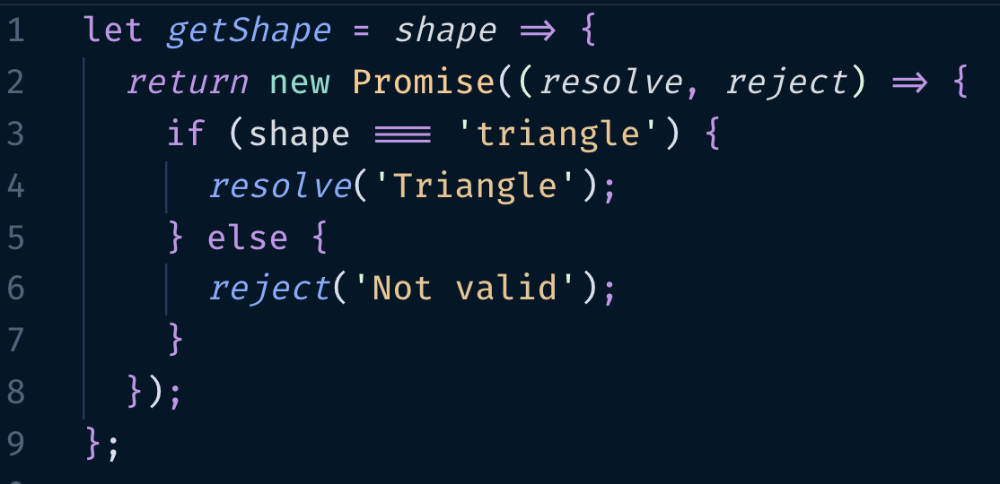
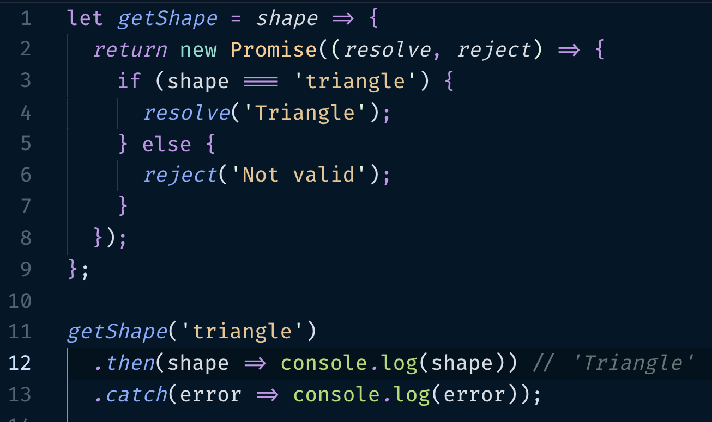
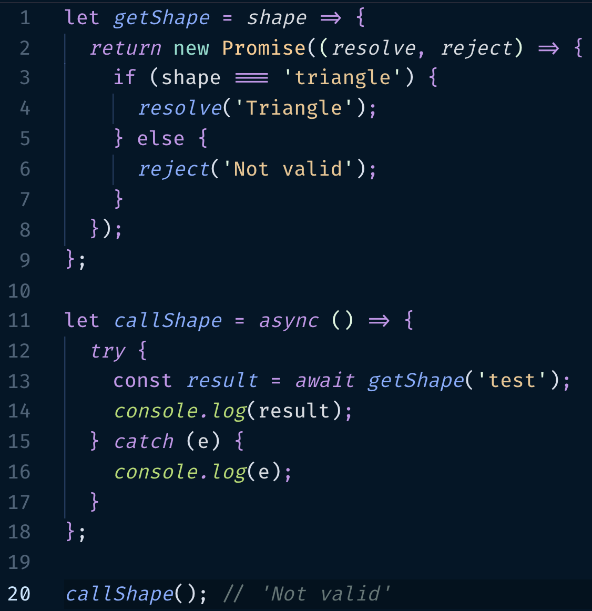
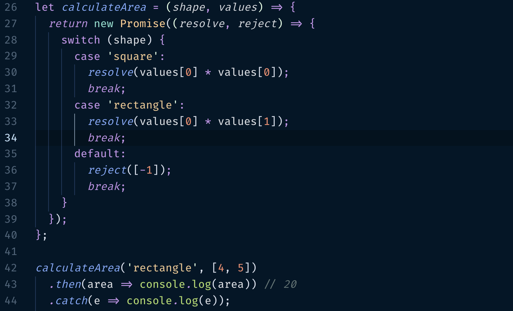
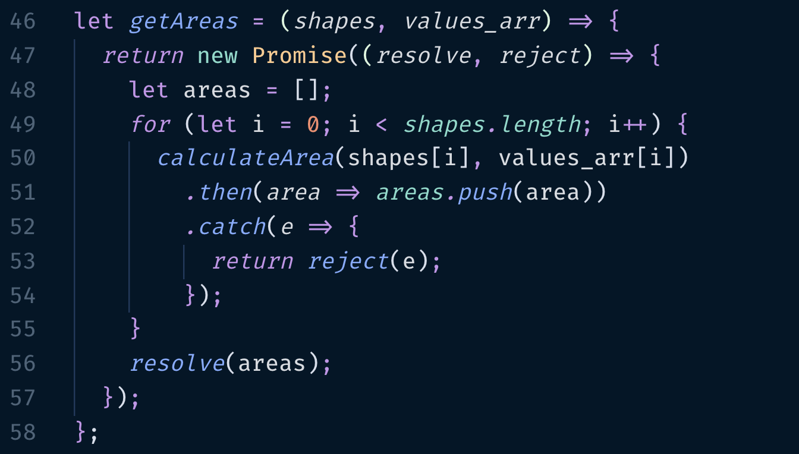
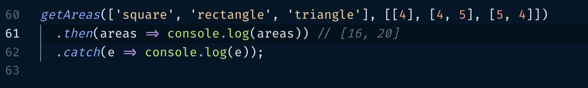
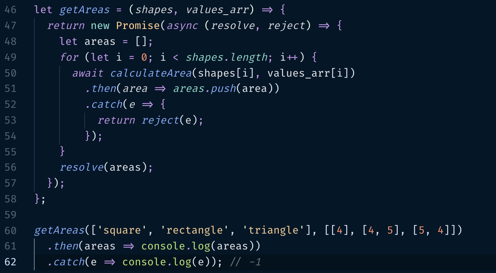

Una promesa en Javascript, promete llevar a cabo una acción/función y retornar un resultado cuando se complete dicha operación. Las promesas en Javascript nos permite poder continuar sin la necesidad de esperar el resultado de una operación, trabajan de manera asíncrona. Las promesas de Javascript son perfectas si usamos frontend modernos como Angular, React o Vue, cuando la interfaz de nuestra app cambia constantemente, así no tenemos que esperar a que una operación se complete para poder continuar.

Las promesas tienen dos callbacks. Cada una reporta el estado de la promesa, que son tres los estados:

- **pending** - su estado inicial,
- **fulfilled** - operación exitosa,
- **rejected** - operación fallida.

> La función Resolve es llamada cuando la promesa es exitosa, y Reject es llamada cuando la promesa es fallida.

Podemos tener acceso a los parámetros de la función en ambos callbacks usando .then() y .catch(), como se muestra a continuación:

then(), también es útil para concatenar llamados entre varias promesas.

### async...await

También podemos llamar las promesas usando **async** y **await**. Siguiendo con el ejemplo anterior sería algo como esto:

Ahora bien, vamos a tratar de ampliar un poco más es el ejercicio agregando el cálculo del área de un par de formas; pasaremos una forma `'square'` ó `'rectangle'` y un arreglo con los valores para el cálculo del área. En caso de que pasemos una forma No definida, entonces retornamos `-1`.

En este caso, calculamos el área de un rectángulo y como resultado nos dá 20, producto de multiplicar su base por su altura.

Ahora iremos un poco más allá y agregaremos una función para calcular el área de un conjunto de formas con sus respectivas dimensiones:

Ésta implementación puede parecer perfecta a simple vista, pero no lo es. No devolverá `-1` como se espera si se ingresa una forma No definida. Dado un triángulo, el resultado esperado es `-1` per éso no sucede.

Recordemos que las promesas no esperan ni se ejecutan de forma lineal o secuencial, es por eso que la promesa `calculateArea(shapes[i], values_arr[i])` resolverá las áreas de las formas que sí son correctas. Es aquí un buen caso donde debemos esperar por el cumplimiento de todas las promesas para continuar (async...await).

En la Línea 47 hemos agregado `async` y en la Línea 50 `await`, para así esperar a que todas las promesas se cumplan y devuelva como resultado la promesa rechazada para 'triangle', en este caso `-1`.

Fuente: [How to Make and Use Javascript Promises](https://medium.com/@imorobebh/how-to-make-and-use-javascript-promises-e1de07a8070c)

### Conclusión

Las promesas en Javascript son un tema de bastante utilidad e importancia hoy en día sobre todo en el uso de Frameworks Modernos como Angular, React o Vue. Así podemos disparar acciones/funciones y mientras se resuelven podemos mostrar otros componentes al cliente o un simple `Loading...`. Y como vemos si no las usamos de forma correcta puede que no funcionen como deberían.
