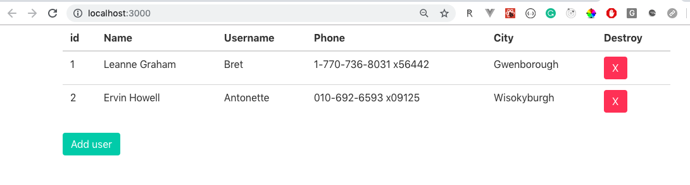

En este post quiero hablar sobre el uso del Hook useContext de React para usarlo en lugar de Redux ya que en algunas situaciones no deseamos agregar un valor a la Store es allí donde Context API entra en escena.

### React useContext

```js
const value = useContext(MyContext)
```

El siguiente ejemplo lo desarollaremos usando **create-react-app** para facilitarnos la vida. En tu terminal escribe los siguientes comandos:

```bash
npx create-react-app user-admin
cd user-admin
yarn add bulma
```

Hemos creado la carpeta **user-admin** y dentro de ella agregamos [bulma como framework para CSS](https://bulma.io/).

### Proyecto Final: React Hooks

El objetivo es poder crear un sencillo User Admin, sin enfocarnos en autenticación ni conexiones a base de datos, nos enfocaremos solamente en React/Bulma y la funcionalidad será; eliminar usuarios y agregar usuarios (usaremos un Modal).

Además en este proyecto NO USAREMOS CLASS COMPONENTS, solamente usaremos Function Components y usaremos los siguientes Hooks: **useState, useContext**



### Video de Youtube

Este tutorial también está grabado y lo puedes encontrar en mi canal de [Youtube](https://www.youtube.com/watch?v=9p7YEaA4_lw&list=PLAN6wHA0cA_dPCuWpwb7riZt3Ds2iylsr)

### Table Layout: Bulma CSS

Creamos el siguiente componente dentro de **src/components/Table/index.js**

```jsx
// src/components/Table/index.js
import React from 'react'

function Table() {
  return (
    <table className="table is-fullwidth">
      <thead>
        <tr>
          <th>id</th>
          <th>Name</th>
          <th>Username</th>
          <th>Phone</th>
          <th>City</th>
          <th>Destroy</th>
        </tr>
      </thead>
      <tbody>
        <tr>
          <td>1</td>
          <td>Juan Pueblo</td>
          <td>juancho</td>
          <td>333-444-555</td>
          <td>Comayagua</td>
          <td>X</td>
        </tr>
      </tbody>
    </table>
  )
}

export default Table
```

Importamos el componente Table en **src/App.js**

```jsx
// src/App.js
import React from 'react'
import Table from './components/Table'
import 'bulma/css/bulma.min.css'

function App() {
  return (
    <div className="container">
      <Table />
    </div>
  )
}
```

### createContext()

Vamos a crear un archivo **src/context.js** donde declararemos el UserContext, podríamos usar este archivo como el archivo central donde creamos los diferentes Context de nuestras Apps, para este ejemplo únicamente usaremos UserContext, pero podríamos usarlo para ThemeContext o guardar la información del Perfil de los usuarios.

```jsx
// src/context.js
import { createContext } from 'react'

const UserContext = createContext()

export default UserContext
```

Ahora crearemos el **UserProvider** dentro de **src/containers/UserProvider.js**, noten que hemos creado el folder containers para separar componentes que manejan datos, trataremos de crear componentes que manejen datos dentro del folder container.

```jsx
// src/containers/UserProvider.js
import React, { useState } from 'react'
import UsersContext from '../context'

const UsersProvider = ({ children }) => {
  const userState = {
    users: [
      {
        id: 1,
        name: 'Leanne Graham',
        username: 'Bret',
        email: 'Sincere@april.biz',
        address: {
          street: 'Kulas Light',
          suite: 'Apt. 556',
          city: 'Gwenborough',
          zipcode: '92998-3874',
          geo: {
            lat: '-37.3159',
            lng: '81.1496',
          },
        },
        phone: '1-770-736-8031 x56442',
        website: 'hildegard.org',
        company: {
          name: 'Romaguera-Crona',
          catchPhrase: 'Multi-layered client-server neural-net',
          bs: 'harness real-time e-markets',
        },
      },
      {
        id: 2,
        name: 'Ervin Howell',
        username: 'Antonette',
        email: 'Shanna@melissa.tv',
        address: {
          street: 'Victor Plains',
          suite: 'Suite 879',
          city: 'Wisokyburgh',
          zipcode: '90566-7771',
          geo: {
            lat: '-43.9509',
            lng: '-34.4618',
          },
        },
        phone: '010-692-6593 x09125',
        website: 'anastasia.net',
        company: {
          name: 'Deckow-Crist',
          catchPhrase: 'Proactive didactic contingency',
          bs: 'synergize scalable supply-chains',
        },
      },
    ],
  }

  const [users, setUsers] = useState(userState)

  return <UsersContext.Provider value={users}>{children}</UsersContext.Provider>
}

export default UsersProvider
```

Hemos creado la función UsersProvider, la cual recibe un argumento, que puede ser un componente o un conjunto de componentes, se podría pensar en esta función como en un High Order Component (HOC), recibe uno/varios componentes y les agrega data, en este caso un arreglo **users**, véase

```jsx
return <UsersContext.Provider value={users}>{children}</UsersContext.Provider>
```

En este componente también usamos [**useState**](https://es.reactjs.org/docs/hooks-state.html) el cual es el Hook que nos permite agregar State a Function Component, no es necesario que sea un Class Component, véase:

```jsx
const [users, setUsers] = useState(userState)
```

Ahora retornamos a nuestro **src/App.js** e importamos el **UserProvider**

```jsx
import React from 'react'
import './App.css'
import Table from './components/Table'
import UsersProvider from './containers/UserProvider'

import 'bulma/css/bulma.min.css'

function App() {
  return (
    <UsersProvider>
      <div className="container">
        <Table />
      </div>
    </UsersProvider>
  )
}

export default App
```

Al hacerlo, todos los componentes Hijo que estén dentro del UserProvider tienen acceso al listado de Usuarios que declaramos anteriormente. Esto viene siendo como el Provider de nuestra Store cuando usamos Redux. Recuerden que el componente UserProvider recibe uno/varios componentes Hijo como argumento y devuelve un nuevo componente con el arreglo **users** como valor.

### Recibir listado de Usuarios

Vamos a crear un nuevo componente dentro de **src/containers/Table/index.js**. Este será uno de los componentes que recibirá los valores del context.

```jsx
import React, { useContext } from 'react'
import UsersContext from '../../context'
import TableHeader from '../../components/Table/Header'
import TableContent from '../../containers/Table/Content'

function Table() {
  const { users } = useContext(UsersContext)

  return (
    <table className="table is-fullwidth">
      <TableHeader />
      <tbody>
        {users.map(user => (
          <TableContent key={user.id} user={user} />
        ))}
      </tbody>
    </table>
  )
}

export default Table
```

Primero lo primero, hemos importado el **UsersContext** que se encuentra en nuestro archivo **./src/context.js**, aparte que hemos importado un par de nuevos componentes que aún no tenemos; **TableHeader** y **TableContent.**

Nótese que hemos importado un nuevo Hook el [**useContext**](https://es.reactjs.org/docs/hooks-reference.html#usecontext) y lo usamos para poder obtener de nuestro UsersContext el valor que éste nos provee; users.

Al final retornamos la tabla con su TableHeader y el cuerpo de la tabla el listado de usuarios que se pasan al TableContent, a continuación los respectivos componentes que nos hacen falta:

```jsx
// <TableHeader /> Es un componente presentacional, no maneja state.
// src/components/Table/Header.js
import React from 'react'

function Header() {
  return (
    <thead>
      <tr>
        <th>id</th>
        <th>Name</th>
        <th>Username</th>
        <th>Phone</th>
        <th>City</th>
        <th>Destroy</th>
      </tr>
    </thead>
  )
}

export default Header
```

A continuación, el componente TableContent:

```jsx
// src/containers/Table/Content.js
import React from 'react'

function Content({ user }) {
  const { id, name, username, phone, address } = user

  return (
    <tr>
      <td>{id}</td>
      <td>{name}</td>
      <td>{username}</td>
      <td>{phone}</td>
      <td>{address.city}</td>
      <td>
        <button className="button is-danger">X</button>
      </td>
    </tr>
  )
}

export default Content
```

TableContent recibe datos y luego también se conectará al context que hemos creado, es por eso que lo he declarado dentro de containers.

### Eliminar Usuarios

Vamos a agregar la funcionalidad para poder eliminar un usuario. A éstas alturas deberías poder listar una tabla con los 2 usuarios que tenemos, así como el botón X para eliminar usuarios, vamos a ponerlo a funcionar.

Para ello, debemos retornar a nuestro UsersProvider:

```jsx
// src/containers/UserProvider.js
import React, { useState } from 'react';
import UsersContext from '../context';

const UsersProvider = ({ children }) => {
  const deleteUser = id => {
    setUsers(prevState => {
      const users = prevState.users.filter(user => user.id !== id);
      return { ...prevState, users };
    });
  };

  const userState = {
    users: [...],
    deleteUser
  };

  const [users, setUsers] = useState(userState);

  return (
    <UsersContext.Provider value={users}>{children}</UsersContext.Provider>
  );
};

export default UsersProvider;
```

Destacamos 2 nuevas cosas; la función **deleteUser**, la cual recibe un **id** como argumento:

```jsx
const deleteUser = id => {
  setUsers(prevState => {
    const users = prevState.users.filter(user => user.id !== id)
    return { ...prevState, users }
  })
}
```

Hemos usado **setUsers** de useState para filtrar los usuarios excepto el usuario con el id que recibe como argumento. Una vez filtrado actualizamos el state del arreglo users.

Y lo segundo, agregamos dicha función (deleteUser) dentro del objeto userState, el cual pasa como valor a los hijos del UsersProvider, de esta manera podemos tener acceso a dicha función.

```jsx
const userState = {
    users: [...],
    deleteUser
  };
```

Perfecto!, espero todavía estén conmigo ;)...
Lo siguiente que haremos será poder conectar nuestro componente **src/containers/Table/Content.js** para poder tener accedo a la función deleteUser.

```jsx
// src/containers/Table/Content.js
import React, { useContext } from 'react'
import UsersContext from '../../context'

function Content({ user }) {
  const { deleteUser } = useContext(UsersContext)
  const { id, name, username, phone, address } = user

  function onDeleteClick() {
    return deleteUser(id)
  }

  return (
    <tr>
      <td>{id}</td>
      <td>{name}</td>
      <td>{username}</td>
      <td>{phone}</td>
      <td>{address.city}</td>
      <td>
        <button className="button is-danger" onClick={onDeleteClick}>
          X
        </button>
      </td>
    </tr>
  )
}

export default Content
```

Nótese como hemos importado el Hook useContext y luego extraemos la función deleteUser de nuestro UsersContext

```jsx
const { deleteUser } = useContext(UsersContext)
```

Agregamos el evento **onClick** al botón X y al mismo tiempo declaramos una nueva función para poder invocar la reciente funcíon **deleteUser.**

```jsx
...
function onDeleteClick() {
  return deleteUser(id)
}

...

<button className="button is-danger" onClick={onDeleteClick}>
  X
</button>
```

### Agregar nuevos usuarios

Estamos llegando a la última sección de este tutorial, el objetivo será poder agregar nuevos usuarios llenando un formulario. Para ello usaremos un Modal de Bulma y un formulario.

Creamos el siguiente componente **src/containers/AddUser/index.js** el cual tendrá su propio state y al final se conectará con nuestro context para agregar el nuevo usuario, similar a deleteUser anterior.

```jsx
import React, { useState } from 'react'

const initialState = {
  id: '',
  name: '',
  username: '',
  phone: '',
  city: '',
}

function AddUser() {
  const [showModal, setShowModal] = useState(false)
  const [values, setValues] = useState(initialState)

  function handleModal() {
    return setShowModal(!showModal)
  }

  function onChange({ target: { name, value } }) {
    return setValues({
      ...values,
      [name]: value,
    })
  }

  const { name, username, phone, city } = values

  return (
    <>
      <button className="button is-primary" onClick={handleModal}>
        Add user
      </button>
      <div className={`modal ${showModal ? 'is-active' : ''}`}>
        <div className="modal-background" />
        <div className="modal-card">
          <header className="modal-card-head">
            <p className="modal-card-title">Add user</p>
            <button
              className="delete"
              aria-label="close"
              onClick={handleModal}
            />
          </header>
          <section className="modal-card-body">
            <form>
              <div className="field">
                <label className="label">Name</label>
                <div className="control">
                  <input
                    className="input"
                    type="text"
                    name="name"
                    value={name}
                    onChange={onChange}
                  />
                </div>
              </div>

              <div className="field">
                <label className="label">Username</label>
                <div className="control">
                  <input
                    className="input"
                    type="text"
                    name="username"
                    value={username}
                    onChange={onChange}
                  />
                </div>
              </div>

              <div className="field">
                <label className="label">Phone</label>
                <div className="control">
                  <input
                    className="input"
                    type="text"
                    name="phone"
                    value={phone}
                    onChange={onChange}
                  />
                </div>
              </div>

              <div className="field">
                <label className="label">City</label>
                <div className="control">
                  <input
                    className="input"
                    type="text"
                    name="city"
                    value={city}
                    onChange={onChange}
                  />
                </div>
              </div>

              <button
                className="button is-primary"
                type="submit"
                onClick={handleModal}
              >
                Submit
              </button>
            </form>
          </section>
        </div>
      </div>
    </>
  )
}

export default AddUser
```

Bien, recorramos el código, hemos importando el Hook **useState** para controlar el mostrar/ocultar del Modal

```jsx
const [showModal, setShowModal] = useState(false)
```

Tambíen usamos useState para crear el State del formulario, será un Formulario Controlado

```jsx
const [values, setValues] = useState(initialState)
```

Las funciones handleModal y onChange:

```jsx
...
// El objetivo es poder mostrar/ocultar el modal
function handleModal() {
  return setShowModal(!showModal)
}

// El objetivo es poder controlar el state de cada Input
function onChange({ target: { name, value } }) {
  return setValues({
    ...values,
    [name]: value,
  })
}
...

// Nos permite poder Abrir el Modal
<button className="button is-primary" onClick={handleModal}>
  Add user
</button>
...
```

En Bulma, para poder abrir un [Modal](https://bulma.io/documentation/components/modal/), ocupamos activarle una clase conocida como **is-active**. Lo hacemos de la siguiente forma:

```jsx
// Si el State showModal es true, se agrega la clase, de lo contrario no
// De esta forma controlamos el mostrar el Modal.
// Nótese que usamos backticks y un if ternario
<div className={`modal ${showModal ? 'is-active' : ''}`}>
```

Por último, agregamos una serie de Inputs con las clases de Bulma para [Formularios](https://bulma.io/documentation/form/input/) y les asignamos las propiedades **value** y **onChange**. Las propiedades value provienen del State local que definimos para los Inputs.

```jsx
...
// State local
const { name, username, phone, city } = values
...

<div className="field">
  <label className="label">Name</label>
  <div className="control">
    <input
      className="input"
      type="text"
      name="name"
      value={name}
      onChange={onChange}
    />
  </div>
</div>
```

Una vez finalizado nuestro componente AddUser, lo importamos en **src/App.js**

```jsx
import React from 'react'
import './App.css'
import Table from './containers/Table'
import UsersProvider from './containers/UserProvider'
import AddUser from './containers/AddUser'

import 'bulma/css/bulma.min.css'

function App() {
  return (
    <UsersProvider>
      <div className="container">
        <Table />
        <AddUser />
      </div>
    </UsersProvider>
  )
}

export default App
```

Ahora viene la función addUser dentro de nuestro UsersProvider **src/containers/UserProvider.js**, proceso similar al de deleteUser:

```jsx
...
const addUser = user => {
  setUsers(prevState => ({
    ...prevState,
    users: [user, ...prevState.users],
  }))
}

const userState = {
    users: [...],
    deleteUser,
    addUser
  };
...
```

Listo!. Hemos agregado la función de addUser en el Provider, pero ahora debemos usarla dentro de AddUser, así que en el componente **src/containers/AddUser/index.js**

```jsx
...
import uuid from 'uuid';
import UsersContext from '../../context';
...

function AddUser() {
  ...
  const { addUser } = useContext(UsersContext);

  ...

  function onSubmit(e) {
    e.preventDefault();

     const newUser = {
      id: uuid(),
      name: values.name,
      username: values.username,
      phone: values.phone,
      address: { city: values.city }
    };

     addUser(newUser);
    setValues(initialState);
  }
  ...

  <form onSubmit={onSubmit}>
  ...
```

Hemos conectado AddUser con nuestro Context, extraemos la función addUser y además creamos una nueva función para el Form; onSubmit. La llamamos **onSubmit**. Dicha función previene el comportamiento por default del navegador con los Formularios y creamos un nuevo objeto el cual enviaremos como argumento para **addUser(newUser)**.

Nótese que para el id, hemos usado la librería **uuid()**, la cual debemos instalar como dependencia de nuestro proyecto e importarla. En una nueva terminal escribe el siguiente comando:

```
yarn add uuid
```

### Aplicando el DRY

Debemos aplicar el Dont Repeat Yourself, como regla en nuestros proyectos, por lo tanto vamos a crear un componente InputForm dentro de **src/components/InputForm/index.js**, el cual es solamente presentacional, no posee propio state.

```jsx
import React from 'react'

export default function InputForm({ label, type, name, value, onChange }) {
  return (
    <div className="field">
      <label className="label">{label}</label>
      <div className="control">
        <input
          className="input"
          type={type}
          name={name}
          value={value}
          onChange={onChange}
        />
      </div>
    </div>
  )
}
```

Recibe una serie de props, los cuales usamos para el Input. Ahora debemos actualizar **src/containers/AddUser/index.js**

```jsx
...
import InputForm from '../../components/InputForm';

...
  <form onSubmit={onSubmit}>
    <InputForm
      label="Name"
      type="text"
      name="name"
      value={name}
      onChange={onChange}
    />

    <InputForm
      label="Username"
      type="text"
      name="username"
      value={username}
      onChange={onChange}
    />

    <InputForm
      label="Phone"
      type="text"
      name="phone"
      value={phone}
      onChange={onChange}
    />

    <InputForm
      label="City"
      type="text"
      name="city"
      value={city}
      onChange={onChange}
    />
...
  </form>
...

```

### Código Fuente

[Repositorio del código](https://github.com/crisecheverria/react-context-hook)

### Conclusión

useContext y CONTEXT API pueden ser una opción para no tener que vernos forzados en usar Redux, se recomienda sobre todo cuando tenemos cambios de Themes en nuestros proyectos, tambien para actualizar la data de un usuario que inicia sesión en la aplicación. Espero les haya servido!
