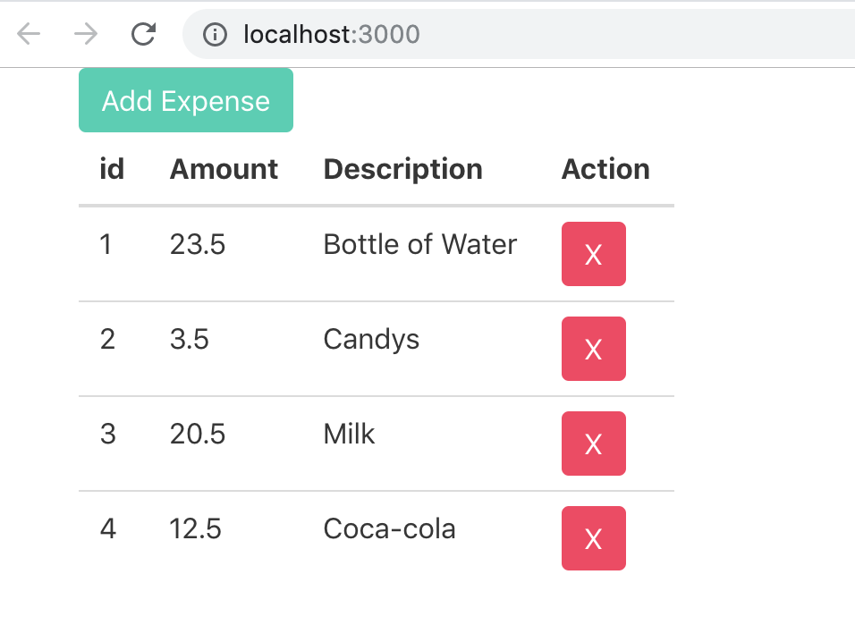

En este Post quiero tocar el tema de Redux, seguido de eso lo combinaremos con React. Haremos una sencilla aplicación para llevar control de gastos, ya que no quería usar el típico Todo App que todo el mundo usa para lecciones de React Redux ;)

### Video en Youtube

Puedes encontrar esta publicación en mi canal de [Youtube](https://www.youtube.com/watch?v=-mq1_zpT5lE&list=PLAN6wHA0cA_fTmMAObPAH5SSKZ61zBa04).

### create-react-app

Desde tu terminal escribe el siguiente comando (debes tener instalado [NodeJs](https://nodejs.org)). Usaremos **npx** para descargar la versión más reciente de create-react-app sin tener que instalarlo primero.

```
npx create-react-app react-redux-tutorial
cd react-redux-tutorial
yarn add bulma
yarn add redux
```

Agregamos las librerias de [Bulma](https://bulma.io/) y [Redux](redux.js.org). Modificamos el componente **/src/App.js** importamos Bulma y creamos el encabezado de la tabla.

```jsx
// ./src/App.js
import React from 'react'
import './App.css'
// importamos Bulma
import 'bulma/css/bulma.min.css'

function App() {
  return (
    <div className="container">
      <table className="table">
        <thead>
          <tr>
            <th>id</th>
            <th>Amount</th>
            <th>Description</th>
            <th>Action</th>
          </tr>
        </thead>
      </table>
    </div>
  )
}

export default App
```

### Reducers

Los reducers son funciones que especifican cómo cambia el estado de la aplicación. En Redux todo el estado de la aplicación es almacenado en un objeto.

Creamos nuestro reducer en la siguiente ruta **./src/reducers/expenses.js**. Usamos un arreglo inicial de expenses (gastos) y exportamos de forma predeterminada una función que tiene **state** y **action** como parámetros. Por ahora, simplemente retornamos el **state** inicial.

```jsx
// ./src/reducers/expenses.js
const initialState = {
  expensesItems: [
    { id: '1', amount: 23.5, description: 'Bottle of Water' },
    { id: '2', amount: 3.5, description: 'Candys' },
    { id: '3', amount: 20.5, description: 'Milk' },
  ],
}

export default (state = initialState, action) => {
  return state
}
```

### Store

El Store es el objeto que reúne las **actions** y los **reducers**. El store tiene las siguientes responsabilidades:

- Contiene el estado de la aplicación.
- Permite el acceso al estado vía **getState()**
- Permite que el estado sea actualizado vía **dispatch(action)**
- Registra los listeners vía **subscribe(listener)**

Es importante que solamente tendremos una store en una aplicación de Redux. Si deseamos dividir la lógica para el manejo de datos, usaríamos una composición de reducers (combinar reducers) en lugar de muchos stores. Creamos nuestra store en **./src/store.js**

```jsx
// => ./src/store.js
import { createStore } from 'redux'
import reducer from './reducers/expenses'

export default createStore(reducer)
```

Importamos nuestro Store al archivo **./src/index.js**. Creamos la función **render()** y accedemos al state de la store mediante la función _getState()_ y lo pasamos como _prop_ a nuestro App Component.

```jsx
import React from 'react'
import ReactDOM from 'react-dom'
import './index.css'
import App from './App'
import * as serviceWorker from './serviceWorker'
// Importamos nuestra store
import store from './store'

// Creamos la función render()
const render = () => {
  // Obtenemos el state de nuestra store con la función getState()
  const state = store.getState()
  // Inyectamos el state a nuestro componente App.js
  ReactDOM.render(<App {...state} />, document.getElementById('root'))
}

render()

serviceWorker.unregister()
```

Modificamos nuestra App component recibiendo el state que inyectamos como prop y además imprimimos el body de la tabla con los valores del array **expensesItems** que proviene de nuestra store.

```jsx
import React from 'react'
import './App.css'

import 'bulma/css/bulma.min.css'

function App(props) {
  // Extraemos el arreglo de expenses de nuestro state (props)
  const { expensesItems } = props
  return (
    <div className="container">
      <table className="table">
        <thead>
          <tr>
            <th>id</th>
            <th>Amount</th>
            <th>Description</th>
            <th>Action</th>
          </tr>
        </thead>
        <tbody>
          {expensesItems.map(item => (
            <tr key={item.id}>
              <td>{item.id}</td>
              <td>{item.amount}</td>
              <td>{item.description}</td>
              <td>
                <button className="button is-danger">X</button>
              </td>
            </tr>
          ))}
        </tbody>
      </table>
    </div>
  )
}

export default App
```

Si ejecutamos nuestra aplicación vía el comando `yarn start` desde nuestra terminal, deberíamos ver algo como lo siguiente:


### Actions

Las acciones son un bloque de información que envia datos desde tu aplicación a tu store. Son la _única_ fuente de información para el store. Las envias al store usando **store.dispatch()**. Las acciones son objetos planos de JavaScript.

Una acción debe tener una propiedad **type** que indica el tipo de acción a realizar. Los tipos normalmente son definidos como strings constantes.

En nuestro archivo **./src/index.js** agregamos una función conocida como _Action Creator_ llamada **addExpense** la cual recibe un parámetro en este caso el valor del expense y su función es despachar una acción a la store mediante `store.dispatch()`, las acciones como menciono arriba, son objetos de JavaScript que poseen la propiedad _Type_ que generalmente es un string dentro de una constante (omitimos la constante), la segunda propiedad es en este caso un _payload_ el cual representa el expense que vamos a enviar a la store. También no olvidemos pasar la acción creada como prop hacia App component.

```jsx
// ./src/index.js
import React from 'react'
import ReactDOM from 'react-dom'
import './index.css'
import App from './App'
import * as serviceWorker from './serviceWorker'

import store from './store'

// Creamos una acción de forma temporal.
const addExpense = val => store.dispatch({ type: 'ADD_EXPENSE', payload: val })

const render = () => {
  const state = store.getState()

  ReactDOM.render(
    // Pasamos la acción como 'props' a nuestro App Component
    <App {...state} addExpense={addExpense} />,
    document.getElementById('root'),
  )
}

// Suscribimos nuestra App a la store para ver las actualizaciones de datos
store.subscribe(render)

render()

serviceWorker.unregister()
```

Nótese que también hemos usado la función **subscribe()** de la store, pasando como parámetro nuestro App Component `store.subscribe(render)`. **Ojo** en este caso suscribimos nuestra App a la store primero y _luego renderizamos_ el contenido de la App al llamar la función `render()`.

### Ejecutar la Acción

Ahora necesitamos UI para poder ejecutar la acción, en este ejemplo usaremos un botón dentro de **./src/App.js**. Recordemos que la _action creator_ que definimos anteriormente, la pasamos a App Component vía `props`

```jsx
import React from 'react'
import './App.css'

import 'bulma/css/bulma.min.css'

function App(props) {
  // Obtenemos la función addExpense de props
  const { expensesItems, addExpense } = props

  // Creamos una función para manejar el onClick del botón
  const handleAddExpense = () => {
    const newExpense = {
      id: 4,
      amount: 12.5,
      description: 'Coca-cola',
    }

    addExpense(newExpense)
  }
  return (
    <div className="container">
      <button className="button is-primary" onClick={handleAddExpense}>
        Add Expense
      </button>
      <table className="table">...</table>
    </div>
  )
}

export default App
```

Hemos extraído la función **addExpense** que recibimos como 'props' y aparte creamos una nueva función **handleAddExpense** para manejar el onClick del botón que agregamos en el UI.

Dentro de _handleAddExpense_ creamos un nuevo expense y llamamos la función _addExpense_ con el nuevo expense como parámetro.

De esta forma el componente hijo **App** puede comunicarse con el componente Padre (./src/index.js). Si nos regresamos al index.js, es allí donde llamamos `store.dispatch()`

```
const addExpense = val => store.dispatch({ type: 'ADD_EXPENSE', payload: val });
```

Ahora, lo único que nos falta para que la acción se lleve a cabo es agregar un caso/condicional en nuestro reducer para poder llevar a cabo el 'ADD_EXPENSE'. Así que dentro de nuestro reducer escribimos lo siguiente:

```jsx
// ./src/reducers/expenses.js
const initialState = {
  expensesItems: [
    ...
  ]
};

// Agregamos un nuevo Case para 'ADD_EXPENSE'
export default (state = initialState, action) => {
  switch (action.type) {
    case 'ADD_EXPENSE':
      return {
        ...state,
        expensesItems: [...state.expensesItems, action.payload]
      };

    default:
      return state;
  }
};
```

El nuevo case **'ADD_EXPENSE'** que hemos agregado retorna un nuevo state, tomando el state existente y solamente agregando el nuevo expense via `action.payload` al arreglo inicial de _expensesItems: []_.

Si todo va bien, al ejecutar `yarn start` y darle clic al nuevo botón podrás ver el nuevo expense.



Y de dicha forma hemos cubierto lo básico que debes conocer sobre Redux. **En la siguiente parte combinaremos Redux con React.**

### Tres Principios de Redux

Redux puede ser descrito en tres principios fundamentales:

- Única fuente de la verdad: El estado de toda tu aplicación esta almacenado en un árbol guardado en un único store.
- El estado es de solo lectura: La única forma de modificar el estado es emitiendo una acción, un objeto describiendo que ocurrió.
- Los cambios se realizan con funciones puras: Para especificar como el árbol de estado es transformado por las acciones, se utilizan reducers puros.

Hasta la próxima!
