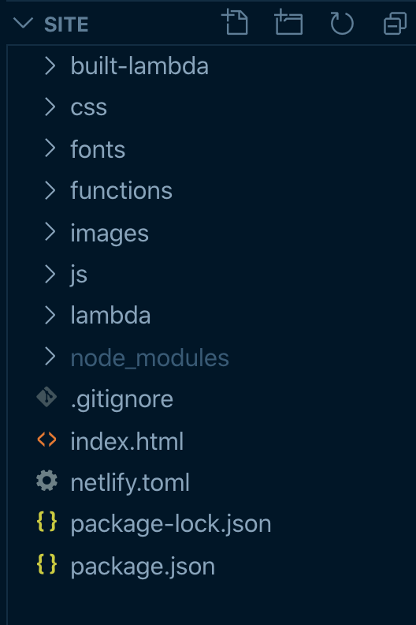

He estado trabajando en un proyecto para un familiar, dandole vida al sitio web que la diseñadora me entregó y he probado algunas herramientas nuevas en dicho proceso. El objetivo primordial es abaratar costos aprovechando al máximo los recursos que existen para sitios web sencillos.

### Herramientas para publicar sitios web estáticos

He estado viendo varios sitios que nos permiten poder publicar contenido de forma sencilla usando sobre todo sitios web estáticos, la lista es bastante interesante, a continuación menciono algunos:

- Github Pages
- [Zeit](zeit.co/)
- [Surge](surge.sh/)
- [Netlify](netlify.com/)

Dejando a un lado a Github Pages (vieja escuela), las demás opciones se ven muy interesantes, me ha sorprendido y mucho Zeit.co ya que no solamente podemos publicar sitios estáticos (html, js y css) sino que también tiene poder de backend vía NodejS, Go, Python y demás, mediante configuración de contenedores, incluso he visto ejemplos de servidores de Graph QL. Encuentro Zeit.co sumamente útil y con múltiples funcionalidades.

Pero en el pasado reciente, me he decantado más por **Netlify**, razónes?, sencillas... es lo que había estado utilizando recientemente.

### Netlify

En su sitio web se definen de la siguiente manera:

> "One workflow. From local development to global deployment. Netlify is everything you need to build fast, modern websites: continuous deployment, serverless functions, and so much more."

Y precisamente es eso lo que he estado necesitando, el poder crear un sitio web sencillo solamente usando HTML, CSS y JS y poder manejar el alojamiento, y el proceso de deploy de manera sencilla y práctica. En el caso de Netlify he estado usando Github para poder hacer el proceso de _Continuos deployment_.

Netlify tiene un [CLI](https://docs.netlify.com/cli/get-started/#manual-setup), pero no lo he usado recientemente, es probable que simplifique aún más algunas cosas.

Así que sí, vía Github puedes crear repositorios, en mi caso privados, para luego conectar Netlify + Github y poder elegir el repositorio mediante el cual deseas que Netlify haga el Deployment. Cada vez que subes tus cambios al repositorio elegido de Github, Netlify inicia el proceso de deployment. Es más puedes elegir una branch específica para que se haga el deployment, no debe ser solamente la _master_ branch.

### Serverless vía Lambda Functions

Resulta que uno de los requerimientos para el sitio web que estaba desarrollando era el poder publicar las últimas 3 fotos de la cuenta en Instagram. Si bien es cierto existen varios sitios donde puedes lograr hacer esto de forma gratuita, ninguno de ellos satisfacía lo que ocupaba.

Buscando la [documentación de instagram](https://www.instagram.com/developer/endpoints/users/) encuentras el siguiente endpoint:

```
https://api.instagram.com/v1/users/self/media/recent/?access_token=ACCESS-TOKEN
```

Donde puedes usar un HTTP call de tipo GET, pasando el respectivo ACCESS-TOKEN y tendrás el listado de post de dicha cuenta.

Ahora bien, debido a que estoy usando Netlify, para mostrar mi sitio estático y no cuento con un servidor para poder llevar a cabo dichas solicitudes HTTP, me veo en la alternativa de usar **Lambda Functions** que Netlify ofrece.

#### Lambda Functions

Creado por Amazon Web Services, _AWS Lambda le permite ejecutar código sin aprovisionar ni administrar servidores. Solo pagará por el tiempo informático que consuma. No se cobra nada cuando el código no se está ejecutando._

_Con Lambda, puede ejecutar código para casi cualquier tipo de aplicación o servicio back-end sin tener que realizar tareas de administración. Solo tiene que cargar el código y Lambda se encargará de todo lo necesario para ejecutar y escalar el código con alta disponibilidad. Puede configurar su código para que se active automáticamente desde otros servicios de AWS o puede llamarlo directamente desde cualquier aplicación web o móvil_ ([Más info](https://aws.amazon.com/es/lambda/))

Y a ésto se le conoce como **Computación sin servidores ó Serverless** ([Más info](https://serverless-stack.com/chapters/es/what-is-serverless.html))

Genial!

Haciendo una pequeña búsqueda de [Funciones Lambda con Netlify](https://functions.netlify.com/examples/?search=instagram), encontré justo el ejemplo que ocupaba para hacer las peticiones al endpoint de Instagram:

```
const axios = require('axios')

exports.handler = function instagram(event, context, callback) {
  const endpoint = 'https://api.instagram.com/v1/users/self/media/recent'
  const token = process.env.INSTAGRAM_ACCESS_TOKEN
  const limit = 5

  axios
    .get(`${endpoint}?access_token=${token}&count=${limit}`)
    .then(({ data: { data: posts } }) => {
      callback(null, {
        statusCode: 200,
        headers: {
          'content-type': 'application/json',
        },
        body: JSON.stringify(
          posts.map(i => ({
            id: i.id,
            link: i.link,
            images: i.images,
            videos: i.videos,
            caption: i.caption.text,
          })),
        ),
      })
    })
    .catch((e) => {
      callback(e)
    })
}
```

El código anterior es un ejemplo de la estructura de una Lambda Function, la cual está compuesta por los siguientes elementos:


Al final, lo que hacemos es un GET al endpoint de Instagram, en este caso usamos **axios** y ocupamos pasar un ACCESS-TOKEN, el cual lo puedo obtener del [siguiente sitio web](https://instagram.pixelunion.net/), ya con esos elementos debo seguir la documentación de Netlify para configurar y testear mi Lambda Function de manera local y posteriormente subirlo al sitio web.

### Estructura del Proyecto

La estructura del proyecto que usé es la siguiente:



Los pasos que seguí fueron crear el proyecto de Node vía `npm init -y` y agregar las siguientes librerías

```
npm i netlify-lambda axios
```

El primero, **netlify-lambda** me permitirá probar el código de forma local, asegurandonos que funcione de manera deseada. Dentro del **package.json** agregamos los siguientes comandos:

```
"scripts": {
    "lambda-serve": "netlify-lambda serve functions",
    "lambda-build": "netlify-lambda build functions"
  },
```

Aparte de eso, creamos el archivo **netlify.toml**, el cual es un archivo de configuración de Netlify para poder probar nuestro proyecto de forma local. El contenido es el siguiente:

```
[build]
    functions = "lambda"
    Command = "npm run lambda-build"
```

Estamos definiendo el nombre del folder dónde se hará el build de la función **functions = "lambda"**, y pasamos el comando para el build que definimos en el package.json.

Creamos el archivo `./functions/getInstagramFeed.js` y agregamos el código de la Lambda Function para obtener el Feed de fotos de Instagram:

```
const axios = require('axios');

exports.handler = function instagram(event, context, callback) {
  const endpoint = 'https://api.instagram.com/v1/users/self/media/recent';
  const token = process.env.INSTAGRAM_ACCESS_TOKEN;
  const limit = 3;

  axios
    .get(`${endpoint}?access_token=${token}&count=${limit}`)
    .then(({ data: { data: posts } }) => {
      callback(null, {
        statusCode: 200,
        headers: {
          'Access-Control-Allow-Origin': '*',
          'Access-Control-Allow-Headers':
            'Origin, X-Requested-With, Content-Type, Accept'
        },
        body: JSON.stringify(
          posts.map(i => ({
            id: i.id,
            link: i.link,
            images: i.images,
            videos: i.videos,
            caption: i.caption.text
          }))
        )
      });
    })
    .catch(e => {
      callback(e);
    });
};

```

En este ejemplo usamos **axios** para poder ejecutar la petición GET al endpoint de instagram, pasamos además el token usando variables de entorno **const token = process.env.INSTAGRAM_ACCESS_TOKEN**, para probarlo en local podríamos agregar el token den un solo, pero para subirlo a Netlify y no mostrar el Token lo recomendable es usar variables de entorno que [debemos de crear en Netlify](https://docs.netlify.com/configure-builds/environment-variables/#declare-variables).

### Probando la función Lambda

Para probar de forma local, lo primero es levantar el servidor de netlify-lambda ejecutando el comando que definimos en package.json **"lambda-serve"** desde nuestro terminal. Este comando levantará un servidor en el puerto 9000.

Luego creamos el siguiente código dentro del archivo `.js/instafeed.js`:

```
const fetchInstafeed = async () =>
  await (await fetch('http://localhost:9000/getInstagramFeed')).json();

fetchInstafeed().then(data => {
  photoList = document.querySelector('#photos');

  data.forEach(photo => {
    const li = document.createElement('li');
    li.className = 'instagram-photos';
    const link = document.createElement('a');
    const img = document.createElement('img');
    img.src = photo.images.standard_resolution.url;
    link.appendChild(img);
    link.href = photo.link;
    link.target = '_blank';
    li.appendChild(link);
    photoList.appendChild(li);
  });
});
```

Insertamos dicho archivo en nuestro `index.html`:

```
  <body class="body">
    ...

    <div class="section-2">
        <ul id="photos"></ul>
    </div>
    ...
    <script src="js/instafeed.js" type="text/javascript"></script>
  </body>
```

Definimos el **id="photos"** para poder insertar las fotos en el DOM. Y creamos los estilos deseados en nuestro archivo CSS.

### Realizar el deploy

Una vez estemos listos para subir nuestro sitio a Netlify creamos el repositorio de Git y en el archivo `.gitignore` definimos las carpetas que no son necesarios subir como el `node_modules` y la carpeta `functions` la cual no es necesaria, debido a que en nuestro archivo **netlify.toml** definimos que el build se haría en la carpeta **lambda**

```
[build]
    functions = "lambda"
    Command = "npm run lambda-build"
```

No olvidemos crear las Variables de Entorno para el ACCESS-TOKEN de Instagram, lo podemos hacer mientras se lleva a cabo del deploy de nuestro sitio. Y además lo más importante es modificar la URL de nuestra función dentro de nuestro archivo `.js/instafeed.js` de **http://localhost:9000/** por el siguiente **/.netlify/functions/**

```
const fetchInstafeed = async () =>
  await (await fetch('/.netlify/functions/getInstagramFeed')).json();

fetchInstafeed().then(data => {
  ...
});
```

Para poder probar que nuestras función trabaja de manera esperada podemos copiar la URL del sitio que Netlify crea, anexando **/.netlify/functions/getInstagramFeed** por ejemplo: https://silly-easley-caaa24/.netlify/functions/getInstagramFeed

### Conclusión

El uso de sitios como Netlify que nos permiten publicar sitios web estáticos y a la vez nos permite poder agregar funcionalidad de terceros para poder ser usados vía Lambda Functions, permite que el sitio sea dinámico. De allí viene el término JAMstack en el cual usamos diversos microservicios como autenticación, búsquedas y funciones serverless simplificando y abaratando los costes de administrar nuestros proyectos web.


### Recursos

- [Adding Serverless Functions to Netlify by Raymond Camden](https://www.raymondcamden.com/2019/01/08/adding-serverless-functions-to-your-netlify-static-site)
- [Serverless Lambda Functions by Brad Traversy](https://www.youtube.com/watch?v=drJwMlD9Mjo&t=1469s)
