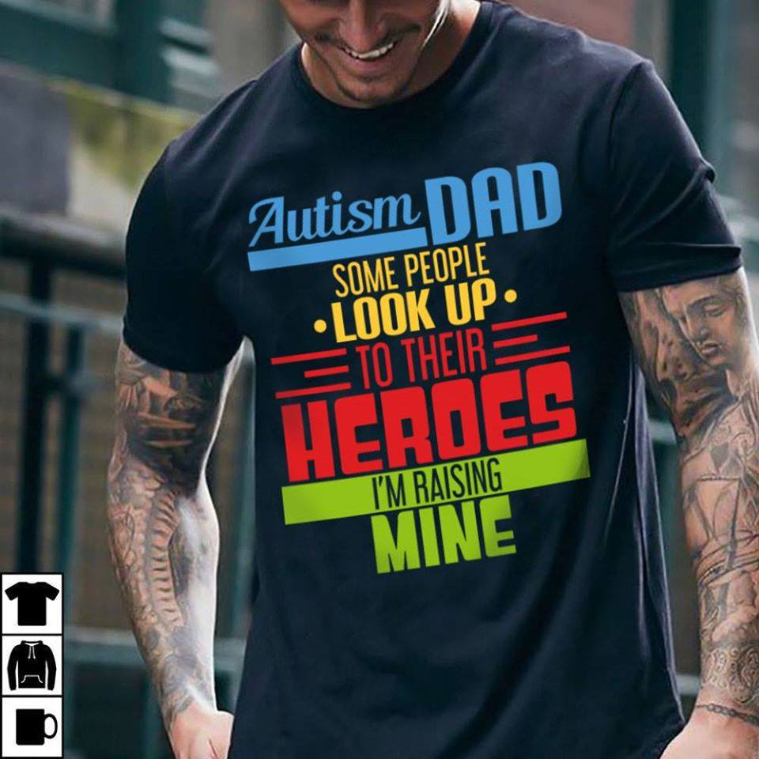

El recíen pasado 2 de Abril se conmemoró el día internacional del autismo. El autismo es un tema que en mi familia conocemos y hemos experimentado muy de cerca, la razón de eso es debido a que convivimos todos los días en casa con un niño autista; mi hijo Ethan.

## Autismo de Ethan

Ethan fué recientemente diagnosticado oficialmente con austismo por el Centro Neuropsiquiátrico para Niños de la ciudad de Gotemburgo, Suecia. Las sospechas de un posible TEA (Trastorno del Espectro Autista) sobre Ethan lo tenemos desde aproximadamente cuando el tenía poco más del año de nacido, pero claro, no estábamos del todo seguros que fuese TEA.

Sin embargo, luego de leer por internet acerca del comportamiento y síntomas de un paciente con TEA junto con mi esposa y algunos familiares más cercanos, fuímos identificando patrones de comportamiento bastante similares al de un niño con TEA. Patrones como ser;

- Alto nivel de concentración en una sola actividad, generalmente actividades que le estimulan mucho.
- No responder al ser llamado por su nombre.
- Preferencia por jugar sólo.
- Evitar ver personas a los ojos cuando se dirigían a el.
- Afición por alinear los objetos de manera horizontal.
- Afición por jugar únicamente con las ruedas de los autos haciéndolas girar constantemente.
- Alta sensibilidad a ciertos sonidos especialmente de máquinas y/o motores. Como ser máquina de afeitar, secadora de cabello, aspiradora y licuadora.
- No determinar a las personas a su alrededor al entrar a una habitación.
- otros

Finalmente luego de mudarnos a Suecia y de visitar la clínica para niños, tuvimos la oportunidad que una especialista revisara a Ethan y sobre todo a su comportamiento. Ethan entró a la habitación de la clínica y al ver su comportamiento en un lapso de 5 minutos y ver cómo reaccionaba, la especialista nos confirmó nuestras sospechas, el niño está dentro del Espectro Autista.

Para mi esposa y yo no fué una sorpresa la afirmación de la doctora, fué más que todo una confirmación de nuestras sospechas y en ese mismo instante sentimos una forma de alivio, ya que finalmente sabíamos basados en la opinión de un experto el porqué Ethan André se comportaba de dicha forma.

Inmediatamente luego de eso, la doctora nos refirió al BNK (Centro Neuropsiquiátrico para Niños) para poder estar en lista de espera y poder iniciar por parte de sus especialistas las diferentes investigaciones y observaciones de comportamiento para poder confirmar un diagnóstico oficial sobre TEA.

Y así fue.

Un grupo de doctores en conjunto conformado por una médico especialista, una pedagoga y una psicóloga llevaron a cabo ciertas entrevistas y observaciones para con nosotros sus padres, sus maestros del daycare y observación del mismo Ethan y llegaron en efecto a la conclusión de que Sí Ethan está dentro del espectro autista.

Sin embargo, nos decían que debido a su edad (3 años) el espectro se ve de forma severa por ahora, pero que el comportamiento suele irse modificando a medida que van creciendo y casi siempre de forma favorable, la mayoría de temores los van superando poco a poco, aunque no es 100% seguro.

## Cómo es Ethan?

Ethan es un niño diferente, es una pieza diferente como todos lo somos en un rompecabezas. Físicamente no tiene ningún tan sólo signo de ser un niño con TEA, tu lo vez de entrada y piensas que es como cualquier otro niño, pero luego de ver su comportamiento durante 5 minutos te das cuenta de que es un niño diferente al resto, y que su comportamiento no es el mismo.

Le encanta salir a jugar como a los demás, le encanta correr por el parque gritando balbuseando (todavía no habla) y haciendo muecas de felicidad, es un niño **hiperactivo.** Y ésa hiperactividad es la que muchas veces como padres, nos colma la paciencia (jajaja debo admitirlo).

Por fortuna no tiene afectado el sentido del tacto, así que le encanta abrazar a los demás, le encanta abrazar a su mamá, a su papá, a sus compañeros(as) del daycare, a sus maestras, y cuando ocupa algo no duda en tomar de la mano al primer adulto que encuentre y mostrarle lo que desea.

Además somos muy afortunados por el hecho de que en el daycare, todo mundo lo quiere, incluso tiene lo que yo llamo un comité de bienvenida, conformado por un grupo de niñas mayores que él, que lo reciben en el daycare con los brazos abiertos y muchos besos y abrazos, tantos que para Ethan llegan a ser demasiado estimulantes y llega al punto de que termina empujandolas y rechazándolas (jajaja), pero es que lo machacan de abrazos.

Es el mismo grupo que se convierte luego en comité de despedida.

> Hej då Ethan, vi ses imorgon! (Adiós Ethan, nos vemos mañana!)

A lo que Ethan muy emocionadamente y hasta al punto de gritar responde:

> Bye bye! Hej då! Adiós!

Sí!. Los 3 idiomas al mismo tiempo! (jajaja)

Si bien es cierto, vivir con un niño autista tiene muchos desafíos, esto debido a que no responde de la misma forma que el resto, no siguen instrucciones de la misma forma que el resto y no se saben expresarse o comunicarse de la misma forma que el resto.

En el caso de Ethan que aparte es hiperactivo, ya se imaginarán cómo se pone cuando desea algo y no es el tiempo de obtenerlo/hacerlo. Son berrinches tras berrinches, enojos tras enojos, llanto tras llanto. Con ellos es un aprendizaje casi a diario que requiere mucha, pero muuuucha paciencia de las personas a su alrededor.

Los padres que tienen un niño neurotípico, osea sin TEA, no saben, ni tienen idea de lo que es tratar con un niño autista, es de esos casos que debes vivirlo en carne propia para poder comprenderlo. Sus berrinches, sus enojos, sus agresiones (porque pueden llegar a ser agresivos) son casi siempre debido a que no saben cómo controlar sus emociones o no saben cómo comunicarse.

Siempre he dicho de forman cómica:

> que su cerebro está "cableado" de forma distinta al resto de nosotros. Y éso mismo es lo que los hace únicos!, difíciles de olvidar!.

Ethan es un niño bastante visual, su memoria es como una cámara fotográfica, nos sorprende a sus padres cómo relaciona objetos debido a las imágenes, a parte que es perfeccionista, si ve que una alfombra tiene una esquina doblada vá y la coloca de la forma que debe ir, si ve que un objeto no está en el lugar que debe estar, vá y lo ordena donde debe ir. Son cosas que para muchos de nosotros son triviales pero para el no.

Le encanta la cocina!

Cada vez que su mamá o su papá preparan algo de comer (Sí! Yo también cocino de cuando en cuando, claro lo básico), Ethan está allí parado con su silla viendo lo que estamos cocinando, hace lo mismo en el daycare. Es más. Cuando está algo incómodo o inquieto lo suelen llevar a la cocina para que se relaje (jajaja), sus maestras nos han comentado eso mismo.

Lo otro que le fascina es jugar con agua, y eso es algo bastante típico de niños con TEA, puede pasar horas jugando con agua o tomándose un baño.

Tiene algunos comportamientos obsesivos y repetitivos como balbucear y recientemente gritar, que llegan a molestar a las personas a su alrededor, incluyendo a nuestros vecinos, y ese es otro aspecto que quiero recalcar, no es que ellos desean hacerlo por molestar sino que es algo que en el caso de Ethan le estimula y mucho, sobre todo cuando está bastante emocionado por hacer una actividad que le encanta.

## Inclusión de niños con TEA.

Éste es un tema que me gustaría recalcar. Muchas veces Ethan puede hacer sonidos algo fuertes, o patear el piso de forma repetida, en el caso de Ethan es porque le causa estimulación y simplemente le gusta hacer ruido.

> Pero obviamente esto puede traer quejas por parte de los demás, así como ciertas miradas curiosas y algunos de enojo.

Y es algo que quiero recalcar, si tú ves un comportamiento similar en otro niño pregunta y verás que lo más probable ese niño sea autista y de dicha forma podrás comprenderlo mejor y aceptarlo. Es algo que simplemente les cuesta controlar.

El día de hoy, un papá y su hijo de aproximadamente 10 ú 11 años se me acercó. Me habló en sueco y al yo responderle en inglés hizo el intento de comunicarme que ellos viven a la par de nuestro apartamento y que su hijo escuchaba a Ethan llorar, patalear, gritar (típicos cuadros de berrinches en niños con TEA) y su esposa quedaba preocupada porque no sabía si el niño lloraba por hambre, no sabía su su mamá estaba en casa y cosas por el estilo.

Me impactó.

Wow dije, que bonito que alguien se me acerque y me diga estas cosas, un completo desconocido para nosotros y su esposa muy preocupada por la situación que escuchaba.

Le expliqué la condición de Ethan y en ese momento Ethan que estaba conmigo empezó a quejarse y a hacer ruidos porque no entrábamos al apartamento y el quería irse para adentro, en ese momento le dije: vez ese es el tipo de ruidos que Ethan hace y lo hace porque su autismo.

Le agradecí que se me haya acercado para conocer de la situación y le dije que estaba muy agradecido también con sus esposa por preocuparse. Son personas completamente desconocidas para nosotros, y aún así, se preocuparon por Ethan. Me encantó.

Le comenté a mi esposa el incidente y le pedí que fuese a visitar a la vecina y le agradeciera el gesto y además le explicara los motivos, para que ella esté más tranquila.

Ocupamos más personas como esta familia que les menciono, ocupamos personas que se preocupen por el bienestar de los demás.

Ellos se han ganado mi gratitud y mi corazón, para siempre!.

Créditos: [National Autism Club](https://www.standforwildlife.club/stores/autism/product/hoodie?fbclid=IwAR2jOF0mo3SgS2UKaLf6sNgHvVJyddjmzQeINyxz3S2xEXTljgpAbaQLt3Y)
